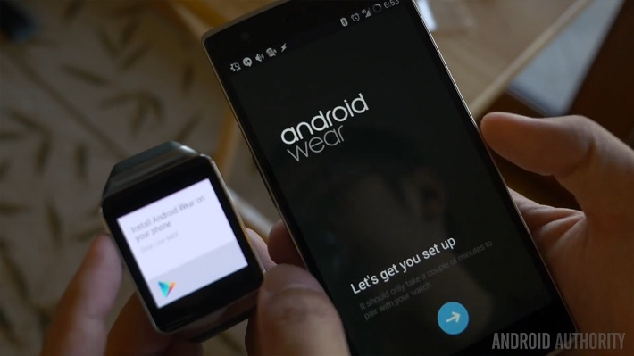
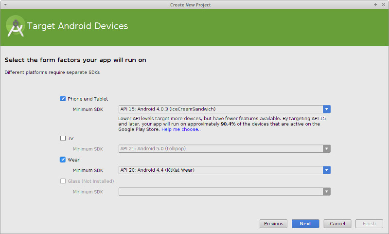
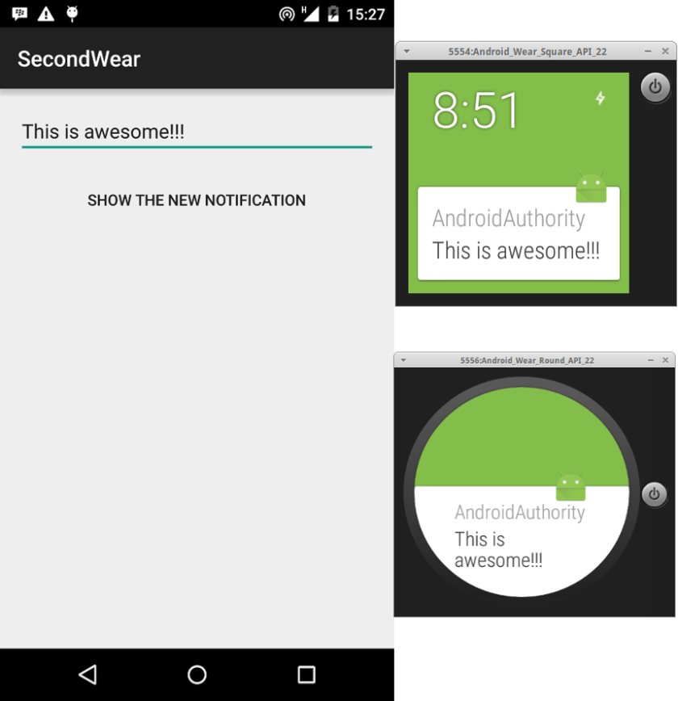
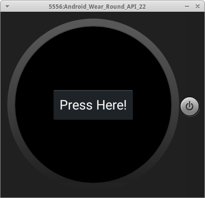
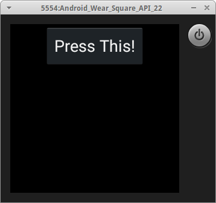
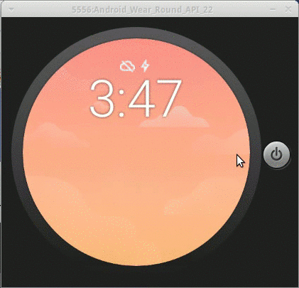

# 如何开发一个简单的 Android Wear 应用程序
  

文章翻译：[邵凯阳](https://github.com/shaokaiyang)

发表时间：2015 年 7 月 3 日  

原文作者：Obaro Ogbo  

文章分类：智能硬件  

## 关于文本

Android Wear 是谷歌为智能手表打造的全新智能开放平台，于 2014 年 3 月 19 日宣布推出。随着科技的发展，越来越多的人开始进行应用程序的开发，但是在 Android Wear 上开发应用程序却会给您带来别样的体验。本篇文章就详细地介绍了一个简单的 Android Wear 应用程序的开发过程。

## 文章内容

上月初，Alex Mullis 写了一篇很精彩的文章，讨论 [为 Android Wear 开发你所需要知道的一切](http://www.androidauthority.com/developing-for-android-wear-everything-you-need-to-know-614648/)。我们现在将把这一步走的更远一些——开发一个简单的 Android Wear 应用程序，为安卓做开发是一个很令人兴奋的尝试，但在您的应用程序中包含 Android Wear 的特性会更加有趣，相信我!

在我们开始之前，请将以下内容记在您的脑海里。可穿戴式应用程序，即使它们跟应用于手持设备的普通应用程序很相似，构建的应用程序在规模和功能上都应该比较小。我想您不想尝试将您手持设备上的应用程序的全部功能替换为可穿戴式的。相反，您应该寻找方法，利用可穿性来完善您手持设备上的应用程序。理想情况下，应在手机上执行大多数运算，并将结果发送至可穿戴设备。

## 准备

我们的应用程序将是一个简单的安卓应用程序，将通知从手机发送到配对的可穿戴设备上，而可穿戴设备只拥有一个相应的嵌入式应用程序和一个单一的点击按钮。

这篇文章中，我们假设您使用 Android Studio。Android Studio 是安卓应用程序开发的实际标准。为了开发可穿戴式应用程序，您需要将您的 SDK 工具更新到版本 23.0.0 或更高，并且让您的 SDK 搭载 Android 4.4W.2 或更高。

然后您应该设置一个可穿戴的 Android 设备或可穿戴的 Android 模拟器。

### 对于一个模拟器

- 使用 AVD 管理器创建一个方形或者圆形的安卓可穿戴设备。
- 启动模拟器设备设备。
- 从谷歌应用商店安装安卓可穿戴应用程序。
- 通过 USB 链接你的手持设备和开发设备。
- 从 AVD 通信端口向手持设备传送指令。

```java
adb -d forward tcp:5601 tcp:5601
```

(每次您连接或是重新连接您的手持设备都要完成这件事)
- 在您的手机上运行安卓可穿戴应用程序并通过应用程序设置连接到模拟器。

### 对于一个安卓穿戴设备

- 通过谷歌应用商店在智能手机上安装安卓可穿戴应用程序。
- 按照应用程序中的说明将你的手持设备和可穿戴设备进行配对。
- 使你的可穿戴设备具有开发人员选项（点击内部版本号 7 次在设置 > 关于）。
- 使能够进行 adb 调试。
- 将可穿戴设备与开发机器连接，并且你应该能够直接对你的可穿戴设备进行应用程序的安装和调试。

## 创建您的项目

对于本教程完整的源代码在[github](https://github.com/obaro/SimpleWearApp)上可以找到，但您也可能想要创建您自己的项目，以在这个过程中获得别样的感觉。Android Studio 提供向导机制来帮助创建一个项目，并且他们会以最好的方式来设置您的安卓可穿戴应用程序项目。单击文件 > 新项目，并按照说明操作。

这个过程[类似于创建一个手机/平板电脑项目](http://www.androidauthority.com/first-android-app-what-you-need-to-know-619260/)。只需确保在"Form Factors"窗口中选择"Phone and Tablet"和"Wear"两个选项。

  

当向导完成时，Android Studio已经创建了一个新项目拥有两个模块——移动模块和穿戴模块。对于每个模块，您可以创建活动、 服务、 布局等。请记住，智能手机应用程序 (移动模块) 应该做大部分工作，像强化处理和网络通信，然后将通知发送到可穿戴设备。

### “mobile” 模块

移动模块与您使用的普通安卓开发是一样的。对于我们的移动模块，我们创建一个简单的活动，使用 EditText 字段和一个按钮。当触碰按钮，输入 EditText 的文本将被作为通知发送到可穿戴设备。

布局是相当直接的:

```xml
<LinearLayout xmlns:android="http://schemas.android.com/apk/res/android"
    xmlns:tools="http://schemas.android.com/tools"
    android:layout_width="match_parent"
    android:layout_height="match_parent"
    android:paddingLeft="@dimen/activity_horizontal_margin"
    android:paddingRight="@dimen/activity_horizontal_margin"
    android:paddingTop="@dimen/activity_vertical_margin"
    android:paddingBottom="@dimen/activity_vertical_margin"
    tools:context=".MainActivity"
    android:orientation="vertical">
    <EditText
        android:id="@+id/editText"
        android:layout_width="match_parent"
        android:layout_height="wrap_content"
        android:layout_marginBottom="16dp"/>
    <Button
        android:id="@+id/actionButton"
        android:layout_width="wrap_content"
        android:layout_height="wrap_content"
        android:layout_gravity="center"
        style="@style/Base.Widget.AppCompat.Button.Borderless"
        android:text="@string/show_notification"
        android:onClick="sendNotification" />
</LinearLayout>
```

主要活动也是相当直接的:

```java
public class MainActivity extends AppCompatActivity {
    EditText editText;
    @Override
    protected void onCreate(Bundle savedInstanceState) {
        super.onCreate(savedInstanceState);
        setContentView(R.layout.activity_main);
        editText = (EditText) findViewById(R.id.editText);
    }
    public void sendNotification(View view) {
        String toSend = editText.getText().toString();
        if(toSend.isEmpty())
            toSend = "You sent an empty notification";
        Notification notification = new NotificationCompat.Builder(getApplication())
                .setSmallIcon(R.mipmap.ic_launcher)
                .setContentTitle("AndroidAuthority")
                .setContentText(toSend)
                .extend(new NotificationCompat.WearableExtender().setHintShowBackgroundOnly(true))
                .build();
        NotificationManagerCompat notificationManager = NotificationManagerCompat.from(getApplication());
        int notificationId = 1;
        notificationManager.notify(notificationId, notification);
    }
}
```

请注意，当创建我们的通知时,我们称其为 extend() 方法, 提供了一个 NotificationCompat.WearableExtender() 对象.

## 运行移动模块

像您运行任何其他安卓应用程序一样运行移动模块。只要您将他与可穿戴设备(模拟器或真实设备) 配对，在您的设备上运行该项目，将在您的穿戴设备上显示通知。

  

### “wear” 模块

在这一点上，您应该能够在您的穿戴设备上查看来自您的移动设备的通知。然而，我们并不满意，我们要建立和运行一个实际的可穿戴应用程序。可穿戴设备，有一个远比手持设备小的屏幕，并且通常为圆形或矩形。这些给他自身的布局带来了挑战。实现了跨越式的是，谷歌为安卓可穿戴应用程序开发者提供了一些优秀的设计准则和 UI 模式。当您使用 Android Studio 项目向导创建您的可穿戴应用程序时，可穿戴 UI 库将自动的包含在您的项目中。确认其是否存在，如果没有存在，请将其添加在 build.gradle 文件中:

```java
dependencies {
	compile 'com.google.android.support:wearable:+'
}
```

如果您创建您的项目时使用了 Android Studio 项目向导，将会有一个包含两个不同布局文件的活动已经建立，这两个不同的布局文件将分别应用于圆形和矩形设备。Activity_wear.xml 文件如下所示:

```xml
<?xml version="1.0" encoding="utf-8"?>
<android.support.wearable.view.WatchViewStub
    xmlns:android="http://schemas.android.com/apk/res/android"
    xmlns:app="http://schemas.android.com/apk/res-auto"
    xmlns:tools="http://schemas.android.com/tools"
    android:id="@+id/watch_view_stub"
    android:layout_width="match_parent"
    android:layout_height="match_parent"
    app:roundLayout="@layout/round_activity_wear"
    app:rectLayout="@layout/rect_activity_wear"
    tools:context=".WearActivity"
    tools:deviceIds="wear">
</android.support.wearable.view.WatchViewStub>
```

注意这个基本小部件。它是 WatchViewStub，是可穿戴 UI 库的一部分。你必须声明"app:"XML Namespace xmlns:app ="http://schemas.android.com/apk/res-auto"，因为可穿戴的 UI 部件声明它们的属性时使用"app:"命名空间。

要特别注意 app:roundLayout 和 app:rectLayout 项目。这会根据可穿戴设备的屏幕形状来加载对应的布局文件。棒!


我们的 round_activity_wear.xml 和 rect_activity_wear.xml 文件都很相似除了几个注意事项。Round_activity_wear 中的小部件是垂直居中和水平的，然而对于 rect_activity，它们只是简单的水平居中。使用 WatchViewStub，您可以自由地为圆形和矩形屏幕设计完全不同的布局。

### round_activity_wear.xml

  

```xml
<?xml version="1.0" encoding="utf-8"?>
<FrameLayout
    xmlns:android="http://schemas.android.com/apk/res/android"
    xmlns:app="http://schemas.android.com/apk/res-auto"
    xmlns:tools="http://schemas.android.com/tools"
    android:layout_width="match_parent"
    android:layout_height="match_parent"
    app:layout_box="all"
    tools:context=".WearActivity"
    tools:deviceIds="wear_round">
    <Button
        android:id="@+id/button"
        android:layout_width="wrap_content"
        android:layout_height="wrap_content"
        android:layout_gravity="center"
        android:text="@string/hello_round"
        android:onClick="beginCountdown" />
    <android.support.wearable.view.DelayedConfirmationView
        android:id="@+id/delayedView"
        android:layout_width="wrap_content"
        android:layout_height="wrap_content"
        android:layout_gravity="center"
        app:circle_border_color="@color/green"
        app:circle_border_width="20dp"
        app:circle_color="@color/white"
        app:circle_radius="60dp"
        app:circle_radius_pressed="60dp"
        app:circle_padding="16dp"
        app:update_interval="100"/>
</FrameLayout>
```

### rect_activity_wear.xml

  

```xml
<?xml version="1.0" encoding="utf-8"?>
<FrameLayout xmlns:android="http://schemas.android.com/apk/res/android"
    xmlns:app="http://schemas.android.com/apk/res-auto"
    xmlns:tools="http://schemas.android.com/tools"
    android:layout_width="match_parent"
    android:layout_height="match_parent"
    android:orientation="vertical"
    tools:context=".WearActivity"
    tools:deviceIds="wear_square">
    <Button
        android:id="@+id/button"
        android:layout_width="wrap_content"
        android:layout_height="wrap_content"
        android:layout_gravity="center_horizontal"
        android:text="@string/hello_square"
        android:onClick="beginCountdown" />
    <android.support.wearable.view.DelayedConfirmationView
        android:id="@+id/delayedView"
        android:layout_width="wrap_content"
        android:layout_height="wrap_content"
        android:layout_gravity="center_horizontal"
        app:circle_border_color="@color/green"
        app:circle_border_width="20dp"
        app:circle_color="@color/white"
        app:circle_radius="60dp"
        app:circle_radius_pressed="60dp"
        app:circle_padding="16dp"
        app:update_interval="100"/>
</FrameLayout>
```

WearActivity 扩展 android.app.Activity (注意不是 AppCompatActivity)，就像任何正常的 安卓智能手机或平板电脑活动。我们在 WatchViewStub上设置一个 OnLayoutInflatedListener 对象，当 WatchViewStub 已经确定可穿戴设备是否是圆形或是矩形时，他将会被调用。您可以使用 OnLayoutInflatedListener 的 onLayoutInflated 方法来找到使用在 findViewById() 中的小部件。在我们的例子中，我们实例化按钮和 DelayedConfirmationView，然后调用 showOnlyButton() 函数来隐藏 DelayedConfirmationView ，并且只显示按钮。

```java
public class WearActivity extends Activity {
    private Button button;
    private DelayedConfirmationView delayedView;
    @Override
    protected void onCreate(Bundle savedInstanceState) {
        super.onCreate(savedInstanceState);
        setContentView(R.layout.activity_wear);
        final WatchViewStub stub = (WatchViewStub) findViewById(R.id.watch_view_stub);
        stub.setOnLayoutInflatedListener(new WatchViewStub.OnLayoutInflatedListener() {
            @Override
            public void onLayoutInflated(WatchViewStub stub) {
                button = (Button) stub.findViewById(R.id.button);
                delayedView = (DelayedConfirmationView) stub.findViewById(R.id.delayedView);
                delayedView.setTotalTimeMs(3000);
                showOnlyButton();
            }
        });
    }

    public void beginCountdown(View view) {
        button.setVisibility(View.GONE);
        delayedView.setVisibility(View.VISIBLE);
        delayedView.setListener(new DelayedConfirmationView.DelayedConfirmationListener() {
            @Override
            public void onTimerFinished(View view) {
                showOnlyButton();
            }
            @Override
            public void onTimerSelected(View view) {
            }
        });
        delayedView.start();
    }

    public void showOnlyButton() {
        button.setVisibility(View.VISIBLE);
        delayedView.setVisibility(View.GONE);
    }
}
```

## 运行穿戴模块

要运行穿戴模块，选择 wear run/debug configuration，并单击播放按钮 (或键入 Shift + F10)。由于这是调试版本，您需要直接安装到您的穿戴设备 (或模拟器)。请确保您的设备连接 (或可穿戴模拟器正在运行)，然后当系统提示时选择您的设备。

  

## 部署一个发布版本

虽然在开发过程中您直接将您的应用程序安装在可穿戴设备上，但是出版和发布应用程序对用户来说是完全不同的。您的可穿戴应用程序必须嵌入在手持设备的应用程序中，当可穿戴设备与用户的手持设备连接的时候，应用程序将会被自动的推送到可穿戴设备上。访问安卓开发者网站关于[包装可穿戴式应用程序](https://developer.android.com/training/wearables/apps/packaging.html) 来获得更多的信息，从而更加恰当的包装您自己的可穿戴应用程序。

通常，完整的代码在 [github](https://github.com/obaro/SimpleWearApp) 上都可以找到，只要你认为是有用的。快乐的编码。

> 更多IT技术干货: [wiki.jikexueyuan.com](wiki.jikexueyuan.com)  
> 加入极客星球翻译团队: [http://wiki.jikexueyuan.com/project/wiki-editors-guidelines/translators.html](http://wiki.jikexueyuan.com/project/wiki-editors-guidelines/translators.html)  

> 版权声明：  
> 本译文仅用于学习和交流目的。非商业转载请注明译者、出处，并保留文章在极客学院的完整链接  
> 商业合作请联系 wiki@jikexueyuan.com  
> 原文地址：[https://www.packtpub.com/books/content/persisting-data-local-storage-ionic](https://www.packtpub.com/books/content/persisting-data-local-storage-ionic)  

