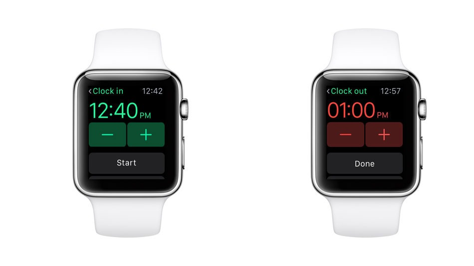
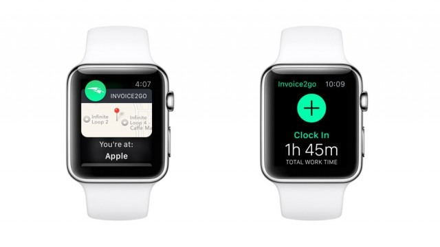

# 5 个提示助你设计出精妙的 Apple Watch 应用软件  
  
文章来源：[http://mashable.com/2015/07/09/invoice2go-apple-watch-app/](http://mashable.com/2015/07/09/invoice2go-apple-watch-app/)  
时间：2015年7月9日  
作者：[Ariel Bogle](http://mashable.com/people/ariel-bogle/)  
  
  
  
## 本文概要  
  
本文简要介绍了 Apple Watch 上一个非常成功的应用 Invoice2go 和其开发公司创始人 Chris Strode 向开发者们分享的 5 个建议，这 5 个建议有助于开发者们开发出成功的 Apple Watch 应用。 
  
## 文章内容  
  
自苹果公司在今年四月发布 [Apple Watch](http://mashable.com/category/apple-watch/) 以来，一部分为这种智能手表设计的第一代应用软件上架后表现良好，而其他的应用[确实真的不怎么赞](http://mashable.com/2015/04/27/apple-watch-in-australia/)。  
  
比较有把握的说，Invoice2go 的智能手表应用属于刚才说的第一类应用软件，至少苹果公司是这么认为的。  
  
大约六个月前，会计平台背后的这家澳大利亚的公司被邀请加入 Apple Watch 项目成为其中的一员。这家公司2014年从重量级的硅谷投资[获得了 3500 万美金的资金投入](http://mashable.com/2014/09/24/invoice2go-tech-millionaire/)。  
  
“苹果公司从我们的应用中发现了无限商机，因为他们希望小型商业所有者感受到就像 iPhone 做到了改变一切，Apple Watch 也能做到。”该公司的创立者 Chris Strode 对 Mashable 澳大利亚分部的人说。  
  
**还可以看到：[‘免提火种’概念应用筛选出让你心跳加速的日期](http://mashable.com/2015/07/07/hands-free-tinder/)**  
  
[Invoice2go 的智能手表应用](https://blog.invoice2go.com/introducing-invoice2go-for-apple-watch/)为木匠，电工和自由设计家这样的人群服务，这些人能从手腕上使用应用开始和结束工作任务，追踪时间和开出发票。当你到达工作岗位时，此项应用甚至可以使用位置感应来提醒你开始计时。  
  
该公司现在正在通过她的平台处理超过一百万张发票，同时这项应用最后入选 2015 年 6 月苹果公司的世界开发者大会，在一个叫做“[为 Apple Watch 所设计](https://developer.apple.com/videos/wwdc/2015/?id=802v)”的部分。  
  
下面是来自 Chris Strode 的五个建议，对开发一个成功的 Apple Watch 应用有所帮助。  
  
## 1.保持用户的操作简易  
  
一名用户与智能手表应用的交互方式应该保持最小限度的效率。  
  
“我认为苹果公司看中我们手表应用的是我们的确把交互保持的很小，”Strode 说道。“操作将会在 1 到 3 秒内完成。”在invoice2go 应用中开始计时使用的是简单的选项例如 是/否 或者 开始/停止，这完美的符合智能手表的格式。  
  
实际上，二进制动作的概念被苹果公司强烈推荐。“苹果公司正是希望人们那样和 Apple Watch 进行交互，”Strode 说。“我们真正用心记住了那些，也正是围绕那个概念来进行设计帮助我们拿到了 WWDC 的成果。”  
  
  
  
## 2.不要仅仅只是将一个智能手机应用移植到 Apple Watch 上  
  
您可能会犯的最大错误就是去尝试把平板电脑或者智能手机上的应用复制到智能手表上，Strode 说道。您需要做的不是复制，而是真正能在手腕上工作的产品。  
  
设计者们将发现他们在手表上起作用的应用部分，Strode 补充道。比如推送通知，会变得非常强大使您不必从您的口袋里面取出手机来查看。  
  
## 3.选择合适的外观  
  
拥有独特的色彩感觉是很重要的。智能手表的黑色背景意味着你必须选对颜色，Strode 是这样说的。“我们真的重新考虑了荧光色，”他说。“就是因为黑色的背景才会去这样做。”  
  
他同时建议跟随苹果公司在他们自己的智能手表应用给出的视觉特性的引导。界面的亮度，屏幕布局的方式甚至还有您如何控制动画效果，这些都是需要考虑的因素，值得花时间作出合适的选择。  
  
  
  
## 4.做一个可靠的智能手机应用  
  
很多人忘了考虑的一件重要事情就是 Apple Watch 是一个配件，Strode 说。没有您的 iPhone 连接 Apple Watch 将不会正常工作。  
  
由于这个原因，大浪的开发工作都需要去研发一个高强功能的智能手机应用来和 Apple Watch 应用进行无缝配对。“本质上你是在手机应用之上开发 Apple Watch 应用的。”Strode 补充道。  
  
## 5.简要和详细  
  
对 Strode 来讲，开发 Invoice2go 的 Apple Watch 应用可以归结为是一个纯粹的创造性消除的处理。“你必须更努力思考屏幕上最重要的元素是什么以及你正在尝试做的是什么，”他说。“你必须剔除一大堆没用的东西到达问题的核心。”  
  
设计者们应该保证自己对待 Apple Watch 设备上的开发态度和对大屏幕设备的一样。“尽管 Apple Watch 是更小的实体资产，它同样花费很多的努力，”他说。实际上，Invoice2go 的团队发现开发的设备屏幕越小就越难把东西做对。  
  
尽管 Strode 欣赏智能手表上的 Uber 应用和苹果公司自己的在锻炼时追踪身体数据的应用，他觉得这个平台才刚开始走向成熟。甚至连苹果公司自己的 APIs 也仍然在参与，他指出。为 Apple Watch 而设计将会在应用能够访问智能手表内核的更多功能时发生变化。  
  
同时，他推荐设计者们挖掘能在这种新设备上产生最最大效果的创意。“然后朝着目标全速前进。”  
  
想为这篇文章加点什么？在评论中分享吧。
