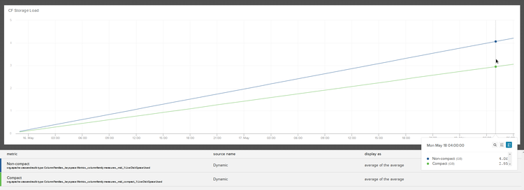

# 理解 Cassandra 压缩储存的作用  
  
  

文章翻译：[朱瀚杰](https://github.com/Owligan) 

发表时间：2015 年 7 月 23 日  

原文作者：mheffner  

文章分类：大数据及商务智能
  
## 关于本文  
  
本文简单介绍了 Cassandra 上时间序列的存储，引入了压缩存储的概念并将压缩存储和非压缩存储方式用简单的例子进行了对比，得出了非压缩存储会消耗更多的存储空间的结论。文章同时提到不同的需求和条件下应该考虑选择不同的存储格式。  
  
  
## 文章内容  

在 Librato，我们对时间序列的储存主要是应用我们一直在研发的自定义架构所建立的 Apache Cassandra。关于它我们之前已经[写到](http://blog.librato.com/posts/time-series-data)并[呈现](https://speakerdeck.com/mheffner/time-series-metrics-with-cassandra)过几次。在 Cassandra 上我们既存储真实的时间序列也存储历史汇总时间序列。Cassandra 存储节点在我们的基础设施中占有最大的足迹，因而这些节点驱动着我们的成本开支，所以我们一直在寻找方式来改进我们数据的效率。  
  
作为我们正在进行的效率改进和后台功能研发的部分，我们最近花时间重新评估了我们的存储架构。自 Cassandra 0.8.x 版本的早些时候以来，我们的架构一直被建立在 Thrift APIs 的内容之上，并且无论何时当我们竖起一个新环路，我们使用‘节点工具’命令来移动它。我们一直都在紧密的跟随 CQL 的发展并且已经将我们的读取路径的部分在 2.0.x 版本中移动到了新的本地接口。甚至，我们想要更进一步关注使用本地 CQL 接口完全构造我们的架构转移（创建 CQL 表，或者他们所称的“列族”）。  
  
## CQL 表存储选项  
  
先前当我们关注 CQL 表结构时困住我们的事情之一是涉及到一个 COMPACT STORAGE 选项--我将停止吐槽并且从这之后把它称作为压缩存储。其定义文档如下：  
  
 “…主要将对 CQL3 之前创建的定义的反向兼容性为目标...在硬盘上提供一个更压缩紧凑一些的数据分布，但这样是以减小灵活性和拓展性为代价的…由于以上原因是不推荐向后兼容性之外使用的。”  
  
在 CQL 之前当 Thrift 接口是唯一的 API 时，所有的表都是以压缩存储的方式建立的。和文档状态一样，它是一个除了向后兼容性外别无它用的遗留选项。  
  
在我们的调研大约进行到这个时候我们偶然发现了某团队研究解析的一篇[博客文章](http://blog.parsely.com/post/1928/cass/)。主要是关于他们对 CQL 表的经验认识。这是一篇很棒的文章，我十分推荐它。文章有一段的标题是 “我们没有使用 COMPACT STORAGE…你敢相信下面发生了什么吗”。它记录了使用压缩存储的他们自己的调研。在这篇文章中，他们提及了当没有对表使用压缩存储时他们看到一个大 30 倍的存储空间容量。如果知道我们所处理的数据库的容量大小，这种类型的增大是不可忽视的。  
  
## CQL 数据分布  
  
那么让我们研究一下一个 CQL 表的数据分布是什么样的。我们将以一个简化过的例子开始，它来自用 Cassandra 建立一项音乐服务的教程指南。我们已经用一个（id，song_id）的指针把表减少到只有一个 id，音乐 id 和歌曲名称。  
  
```javascript
CREATE TABLE playlists_1 (   id uuid,   song_id uuid, title text,
PRIMARY KEY  (id, song_id )
);

INSERT INTO playlists_1 (id, song_id, title)

  VALUES (62c36092-82a1-3a00-93d1-46196ee77204,
  7db1a490-5878-11e2-bcfd-0800200c9a66,
  'Ojo Rojo');

INSERT INTO playlists_1 (id, song_id, title)
  VALUES (444c3a8a-25fd-431c-b73e-14ef8a9e22fc,
  aadb822c-142e-4b01-8baa-d5d5bdb8e8c5,
  'Guardrail');
```
  
现在让我们来看一下它的数据分布是什么样的。我们将使用 sstable2json 来把原始 sstable 转储成一个我们可以分析的格式：  
  
```javascript
$ sstable2json Metrics/playlists_1/*Data*

[
    {
        "columns": [
            [
                "7db1a490-5878-11e2-bcfd-0800200c9a66:",
                "",
                1436971955597000
            ],
            [
                "7db1a490-5878-11e2-bcfd-0800200c9a66:title",
                "Ojo Rojo",
                1436971955597000
            ]
        ],
        "key": "62c3609282a13a0093d146196ee77204"
    },
    {
        "columns": [
            [
                "aadb822c-142e-4b01-8baa-d5d5bdb8e8c5:",
                "",
                1436971955602000
            ],
            [
                "aadb822c-142e-4b01-8baa-d5d5bdb8e8c5:title",
                "Guardrail",
                1436971955602000
            ]
        ],
        "key": "444c3a8a25fd431cb73e14ef8a9e22fc"
    }
]
```
  
你可以看到，每一排都存在有两个列插入，一个列给主关键字的元素，第二个列给表中剩下的“title”列。同样注意到名称列的名字被加入到每一排的列关键字中。这一切说明，列关键字赋予的重复副本的数量是合适的，和一个 64 位的列时间标记。  
  
## 使用压缩存储的同一个表分布  
  
让我们来比较一下使用压缩存储选项的同一个表，再看看同一排的存储格式看起来是什么样。  
  
```javascript
CREATE TABLE playlists_2 (   id uuid,   song_id uuid, title text,
PRIMARY KEY  (id, song_id )
) WITH COMPACT STORAGE;

INSERT INTO playlists_2 (id, song_id, title)
  VALUES (62c36092-82a1-3a00-93d1-46196ee77204,
  7db1a490-5878-11e2-bcfd-0800200c9a66,
  'Ojo Rojo');

INSERT INTO playlists_2 (id, song_id, title)
  VALUES (444c3a8a-25fd-431c-b73e-14ef8a9e22fc,
  aadb822c-142e-4b01-8baa-d5d5bdb8e8c5,
  'Guardrail');

[
    {
        "columns": [
            [
                "7db1a490-5878-11e2-bcfd-0800200c9a66",
                "Ojo Rojo",
                1436972070334000
            ]
        ],
        "key": "62c3609282a13a0093d146196ee77204"
    },
    {
        "columns": [
            [
                "aadb822c-142e-4b01-8baa-d5d5bdb8e8c5",
                "Guardrail",
                1436972071215000
            ]
        ],
        "key": "444c3a8a25fd431cb73e14ef8a9e22fc"
    }
]
```
  
和名字所代表的一样，存储格式确实更加紧凑了。对同一排现在只有单独一个列同时这一列并不包括列的字符串名。如果你只看原始表数据这样会描述不充分，但是你可以结合架构一起来定义余下列的名字。  
  
## 从长远看这会是什么样的？  
  
正如你从原始输出所看到的一样，默认的 CQL 格式是更加冗长的。然而，硬盘上的 sstables 是被压缩过的，所以这个重复列名称的极端冗长性起什么作用？  
  
为了比较这两种方式我们建立了两个表：一个使用默认存储格式而另一个使用了压缩存储。我们的架构和上面的播放列表相似：一个行关键字，在列关键字中有 2-3 个列，和单独一个值列。在几天时间内我们推入分段工作负载通过它--每次对两个表写入相同的行。下面是两个 sstables 中每一个的存储载入图表：  
  

  
结果告诉我们，对我们的测试用例，无压缩存储将多需要大约 35% 的存储空间（并且任何额外的处理都需要如此）。这样就清楚地知道了在我们写入的数据卷当中，非压缩存储中 35% 的存储是没有被有效利用正常工作的。那么那里为什么会有一个选项？  
  
一件需要注意的事情是我们没有将数据列压成行。我们的数据模式始终在用一个整体作为存储物（最初是 JSON，现在是 ProtoBuf），支持在不调整 Cassandra 架构的条件下增加/移除列的操作。如果我们向 Cassandra 架构中扩展列，存储空间的增加将会变的非常大，因为每个增加的列将会重复列关键字和时间标记字段。  
  
## 为什么不一直用压缩存储呢？  
  
自然而然有人会问既然和无压缩存储方式相比如此节约成本，为什么不一直使用压缩存储。回答是有一些情况下并不能使用压缩存储。  
  
### 额外增加的行列  
  
如下所示，您不可以越过主关键字创建一个以上的列。因为我们看到压缩存储在存储模式中生成了一个列，您被单一行关键字，单一列关键字（作为多列组成部分）和单一列数据值的限制所拦住了。  
  
```javascript
cqlsh:Metrics> CREATE TABLE playlists_3 (   id uuid,   song_id uuid,
           ... title text, artist text,
           ... PRIMARY KEY  (id, song_id )
           ... ) WITH COMPACT STORAGE;
Bad Request: COMPACT STORAGE with composite PRIMARY KEY allows no more than one column not part of the PRIMARY KEY (got: title, artist)
```
  
  
如果在你的数据模式中需要更多的列值，你有两个选择：不使用压缩存储，或者将他们序列化成单一列数据值，比如 Json，ProtoBuf，Avro 等。在那样的数据模式下更新列将不得不从一侧采取操作并必须在你的操作中不可分。考虑到你将不能利用 Cassandra 的轻量级交易进行更新这一点是非常重要的。对我们自己的测试用例来说，我们使用了 Json 和 ProtoBuf 数据团，因为我们的数据模式是只添加的。  
  
### 架构灵活性  
  
和之前那一点类似，一个由压缩存储构建的表在它被创建之后不能变动。举个例子，使用压缩存储时你不能对一个表增加或者移除列：  
  
```javascript
cqlsh:Metrics> alter table playlists_1 DROP title;
cqlsh:Metrics> alter table playlists_2 DROP title;
Bad Request: Cannot drop columns from a COMPACT STORAGE table
cqlsh:Metrics> alter table playlists_1 ADD artist text;
cqlsh:Metrics> alter table playlists_2 ADD artist text;
Bad Request: Cannot add new column to a COMPACT STORAGE table
```
  
这意味着，你同样不能为新增列创建索引。比如，我们不能新增一个艺术家列，也不能以艺术家名字索引歌曲。  
  
## 结论  
  
我们的 Cassandra 主要用例是打的时间序列数据集存储。我们必须为了最大硬盘效率作优化，因为我们的存数载入和成本是和设备服务的使用直接成比例的。额外多出的 35% 存储的意义是重大的。  
  
时间序列数据是只添加的并且在一些识别的 TTL 后频繁地取出系统的。通常在时间序列数据被写入后再修改它是不现实的，所以对数据格式的任何改变都必须以对新数据的新增补丁形式完成。我们使用描述性的序列化格式例如 JSON 或者 ProtoBufs 来定义数据列支持随时对它们修改。一个架构改变只能被应用到新数据点，而我们可以继续支持老的架构格式直到原来的数据完全被取出。  
  
如果存储效率并不是你的首要考虑因素，那么架构灵活性和非压缩表提供的交易处理的升级可以让应用发展更容易，考虑下你如何构架可以随时改变和你是否以后想要添加移除列或者建立额外索引的灵活性。  
  
感谢[ Opsmatic](https://opsmatic.com/) 的 Mikhail Panchenko 审阅文章早期版本。  
  
如果你喜欢这篇文章想要加入 Cassandra，[ 来和我们工作](http://librato.jobs/)！

> 更多IT技术干货: [wiki.jikexueyuan.com](wiki.jikexueyuan.com)   
> 加入极客星球翻译团队: [http://wiki.jikexueyuan.com/project/wiki-editors-guidelines/translators.html](http://wiki.jikexueyuan.com/project/wiki-editors-guidelines/translators.html)   

> 版权声明：   
> 本译文仅用于学习和交流目的。非商业转载请注明译者、出处，并保留文章在极客学院的完整链接   
> 商业合作请联系 wiki@jikexueyuan.com   
> 原文地址：[http://blog.librato.com/posts/cassandra-compact-storage?utm_campaign=social-blog-posts&utm_content=cassandra-compact-storage&utm_medium=social&utm_source=hackernews](http://blog.librato.com/posts/cassandra-compact-storage?utm_campaign=social-blog-posts&utm_content=cassandra-compact-storage&utm_medium=social&utm_source=hackernews)
