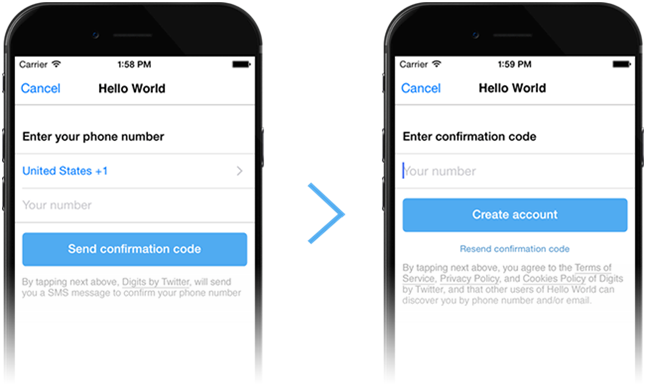

# 在 iOS 开发中使用 TWITTERKIT & DIGITS


文章翻译 ：[周倍同](https://github.com/tmac1997)

发表时间：2015 年 7 月 20 日 

原文作者：DORON KATZ

文章分类：移动应用开发

## 关于本文

相信大家都或多或少的通过 QQ 账号登录过网站或者 App，现在 Twitter 账号也能实现相同的功能了。Twitter 为开发者提供 TWITTERKIT 和 DIGITS ，让用户使用他们的服务，简化用户登录的步骤，在很大程度上能增加网站的转化率，同时还能更加有效的防止账号泄露。本文中将会介绍到如何使用 TWITTERKIT & DIGITS 实现通过 Twitter 账号登录。

## 文章内容

### 什么是 TwitterKit & Digits？

在本文中，我们会接触到 Twitter 在今年早些时候发布的新的[登录](https://dev.twitter.com/products/signin) API，TwitterKit 和 Digits，封装为 [Fabric](https://fabric.io/) 这以整套开发套件的一部分，同样也为你提供了两段简短的代码让你能在你的 iOS App 中引入 Twitter 的登录机制。


Facebook 和 Google 通过他们在 iOS 开发中的 SDK 或者 Accounts.framework 在一段时间内统治了单点登录范式，鼓励开发者们为他们的用户提供一种统一的登录样式。Twitter 最终决定登上这辆顺风车并通过增加增加登录参与和提供一种更加准确的方式让用户无需记住个人密码就能登录自己喜爱的 App 来提升自己的品牌。

通过允许用户通过 Twitter 账号登录，开发者会获得用户的 Twitter 信息和发布的推文以及人际关系。只要 Twitter 账号得到确认，App 就能通过账号、接触用户的推文记录或者联想一些特定的关键字或标签让用户更好的参与进来。

除了提供单点登录，Twitter 同样也提供了 [Digits](https://dev.twitter.com/products/digits)，允许用户通过使用电话号码实现匿名登录，与 Facebook 新的[匿名登录 API](https://developers.facebook.com/products/anonymous-login/) 有异曲同工之处。


### 使用 Digit 的好处

Digits 的基本原理是用户相信你的 App 或者网站，并提供他们的 Twitter 账号信息用于登录。对于那些想要保护自己的社交隐私的用户来说，还有另外一个选择，就是提供一个独一无二的号码，通常是手机号，作为身份验证。



对用户来说另一个好处就是登录和注册变得非常简单，而不需要填写一些非常麻烦的身份验证问题，你只需要从用户那里获得他们收到的作为身份验证确认短信的验证码，就能允许他们登录了。

接下来就简短的介绍一下 TwitterKit 和 Digits 以及如何使用他们。

### 通过 TwitterKit 登录

Twitter 想要让他们的验证机制对开发者来说更加简单有效、更具吸引力，事实上他们正是这么做的。通过使用 SDK 作为 Twitter 的 [Fabric](https://get.fabric.io/) 开发套件的一部分，你需要将你的 Twitter App 准备就绪，为了使用提供的 SDK 而注册。TwitterKit 目的是使用 [Accounts.framework](https://get.fabric.io/) 对 iOS 上存在的 Twitter 账号施加影响。Accounts.framework 是使用比较广泛的一个基础框架，作为替代可以使用 [OAuth](https://en.wikipedia.org/wiki/OAuth) 机制。

使用 Twitter 验证登录的最简单的方法就通过创建的按钮，TWTRLogInButton，下面我们就通过使用 iOS 的 Swift 语言来试一下。

```swift
let authenticationButton = TWTRLogInButton(logInCompletion:
        { (session, error) in
            if (session != nil) {
                      //We signed in, storing session in session object.
            } else {
               //we get an error, accessible from error object
            }
})
```

整段代码非常简单，创建了一个 TWTRLoginButton 子类，可以增加你的视图层次，实现与用户之间的交互。

### 通过 Digits 登录 

上面我们使用 TwitterKit 创建了一个登陆按钮，接下来我们就用 Digits 来完成同样的功能。Digits 使用起来也是非常简单，下面我们再次通过一个简单的方法创建按钮，DGTAuthenticateButton。

```swift
let authenticationButton = TWTRLogInButton(logInCompletion:
        { (session, error) in
            if (session != nil) {
                      //We signed in, storing session in session object.
            } else {
               //we get an error, accessible from error object
            }
})
```

### 总结

使用 TwitterKit 和 Digits 开发 iOS 都非常直截了当,虽然意图不同。TwitterKit 允许开发者有全部的权限接触到用户的历史记录，Digits 则相对来说比较受限，能更好的保护用户的账号隐私。

如果用户相信你的 App 并且很放心的把他/她的历史记录权限提供给你的话，你可以选择在之后的 App 运行中使用它们。关于使用 TwitterKit 和 Digits 的完整的 iOS 参考资料在[这里](https://dev.twitter.com/twitter-kit/ios-reference)。

TwitterKit 是否能被广泛的接受和使用还有待观察，但另一方面，TwitterKit 能为开发者提供更多的选择，包括 Facebook 和 Google+  的登录机制在内，用户可以选择他们比较相信的社交媒体账号作为自己的登录验证。

提供一种匿名登录方式的意图正好与如今世界对隐私的重视相契合，Digits 无疑提供了一种不会造成信息泄露的登录方式，用户能直接的使用自己的电话号码进行登录。

上文中我们简短的演示了一下如何通过 iOS 的开发语言 Swift 来使用 Twitter 的 SDK，除此之外还有 Android 的 SDK 版本。据 Twitter 公布，网页版的 SDK 正在准备当中。

总的来说，TwitterKit 和 Digits 是很值得慢慢去探索的，同样的还有 Fabric 开发套件中提供的其他工具，包括 analytics 和 beta-distribution 工具等等。

> 更多IT技术干货: [wiki.jikexueyuan.com](wiki.jikexueyuan.com)   
> 加入极客星球翻译团队: [http://wiki.jikexueyuan.com/project/wiki-editors-guidelines/translators.html](http://wiki.jikexueyuan.com/project/wiki-editors-guidelines/translators.html)   

> 版权声明：   
> 本译文仅用于学习和交流目的。非商业转载请注明译者、出处，并保留文章在极客学院的完整链接   
> 商业合作请联系 wiki@jikexueyuan.com   
> 原文地址：[https://www.packtpub.com/books/content/developing-twitterkit-digits-ios](https://www.packtpub.com/books/content/developing-twitterkit-digits-ios)
