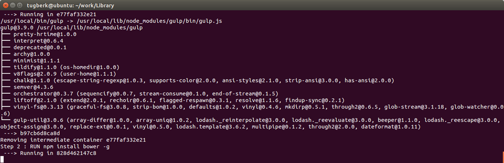

# 玩转 Dcoker：Hello World, 开发环境和你的应用  -- 周倍同

来源：http://www.tugberkugurlu.com/archive/playing-around-with-docker-hello-world-development-environment-and-your-application

时间：2015年7月13日

作者：Tugberk Ugurlu

## 关于本文

Docker 是一个开源的应用容器引擎，让开发者可以打包他们的应用以及依赖包到一个可移植的容器中，然后发布到任何流行的 Linux 机器上。几乎没有性能开销,可以很容易地在机器和数据中心中运行。最重要的是,他们不依赖于任何语言、框架包括系统。

## 文章内容

当你想写博客记录点什么的时候，很有可能是你已经学到了一些东西 :) 就像我现在一样。我已经研究 Linux 有一段时间了，当初我没想到能像现在这样顺利。这感觉很棒，我必须得承认以前一直使用 Windows 作为开发环境的确让我错过了一些好东西。然而，有一件事让我觉得很后悔：.NET 生态系统。对于编写应用来说，这是功能非常强大的生态系统之一，而且能轻易的移植到非 Windows 的环境中，进入这些开发环境的大门正向我敞开着。

我已经上手 [Docker](http://docker.com/) 有一段时间了，大部分时间我都在试着理解其中的概念，因为如果长期使用 Windows 进行开发的话，这些概念对你来说会很陌生。理解完概念后，最有趣的部分就要来了。在这篇文章中，我会向你们展示我为什么如此喜爱 Dcoker。

### 为什么选择 Dcoker

下面是为什么我觉得 Docker 很有用（和其他人的原因比起来并没有什么太大的不同）：

- 可重复、声明式的环境。在你的开发中、CI、QA（也称为 your Pre-Production）环境中使用 [Docker compose](https://docs.docker.com/compose/) 会更方便快捷。

- 当你在学习使用 [Redis](http://redis.io/)、[RabbitMQ](https://www.rabbitmq.com/) 等新工具的时候，阅读文档并试着将它们好好理解吸收。执行 Dcoker 运行命令，创建一个容器。使用容器中的工具进行开发，最后删除掉容器。

- 能够帮助你调配文件。AWS，Azure，或者其他的什么。无论你在哪儿，你都能使用相同的脚本来调配文件。

- 转变你的思维方式，将你的解决方案模块化（这里我提到了 microservices）。这能帮助你避免做出一些错误的选择。比如说，通过堆栈来开发应用的每个部分。这样不仅能够帮助你更好的理解程序，使用正确的工具进行开发，而且你也能将你解决方案中不同的部分交给擅长不同领域的技术开发人员分别去开发。我在这强烈推荐去看看 .NET Rocks 播客上的 [Building Microservices with Howard Dierking](http://www.dotnetrocks.com/default.aspx?showNum=1150) 来深入的了解这部分。

- 这点我并不太清楚，但是 Docker 能让人们 docker 化仓库的环境变得不是那么重要了。

Docker 中可能还会有很多其他的要素让我爱上它。

### Hello World

我猜你们现在已经安装好了 Docker 正准备和我一起来学习它。接下来，我将使用 Ubuntu 14.04 LTS，在 OS X 上应该也是一样的。

正如你所预料的，“Hello World”这个例子同样是被声明和打包过的（像之前提到的，docker 化）。为了让 “Hello World” 运行起来，只需要执行下面的命令：

```
docker run ubuntu:14.04 /bin/echo 'Hello world'
```

当你执行这段代码时，执行过程会在 [Docker Hello World docs](https://docs.docker.com/userguide/dockerizing/#hello-world) 中简短的解释一下，如果你有一个基于 [Ubuntu 14.04 image](https://registry.hub.docker.com/_/ubuntu/) 的容器，在里面输出 'Hello World' 然后退出。


像上面提到的，这个容器在输出完成后就会消失，但是仍在运行中。如果你执行以下代码，你就会发现那个容器。

```
docker ps -a
```


通过运行基于我们从 docker ps output 获得到的容器 ID 的命令，我们能开启对应的容器。

```
docker start --attach 6a174ac370a2
```

我们同样用 [--attach switch](https://docs.docker.com/reference/commandline/start/) 连接到 STDOUT/STDERR 和之前的 signals，这就是为什么我们能看见 hello world 写在我们的控制台里。接下来让我们看一个更加实用的容器相关的例子。

```
docker run -d ubuntu:14.04 /bin/sh -c "while true; do echo hello world; sleep 1; done"
```

这个正是你能在 Docker Hello World doc 的 ["A daemonized Hello world"](https://docs.docker.com/userguide/dockerizing/#a-daemonized-hello-world) 部分找到的例子。有趣的是这个-d switch，它告诉 Docker 运行容器并将它放在后台。如果我们现在运行 docker ps，我们就可以看见这个容器仍然处于运行状态。
 


执行以下基于容器 ID 的代码，我们可以连接到一个正在运行中的容器的 STDOUT/STDERR。

```
docker attach ff2847155ced
```


你可以从容器中分离开来，通过 CTRL-p CTRL-q 让它单独运行。

同样的，你应该已经注意到了我们第一次执行的运行命令花了一小段时间去完成，因为需要从 registry 下载所有的 images。然而第二次几乎是在一瞬间就执行完了，因为 Ubuntu 14.04 已经存在了。所以，我们认识到 Docker images 是不可变的、可组合的，这一点很棒。通过执行 docker images 命令你可以看到在你的 host 下的 images。


### 开发环境

之前提到的，Docker 能够很容易的引入文件并且使用它们。比如说， [Redis is on Docker registry](https://registry.hub.docker.com/_/redis/)，我将它作为另外一个容器运行。

```
docker run --name my-redis -d redis:3.0.2
```


我们可以看见 TCP 端口 6379 被展示了出来，这正是 Redis 展示的端口。然而，我需要知道这个 host 的 IP 地址去连接到 Redis instance。我们可以通过 [inspect command](https://docs.docker.com/reference/commandline/inspect/) 得到一个正在运行的容器的 IP 地址。

```
docker inspect --format '{{ .NetworkSettings.IPAddress }}' dfaf0cf33467
```


现在我可以使用我安装的我的 host 中的 [redis-cli tool](http://redis.io/commands) 来连接到 Redis instance。

```
redis-cli -h 172.17.0.10 -p 6379
```


我随时都能选择开启或者结束运行容器。几乎所有的事情都可以遵循这样的一个过程（比如 Ruby, GoLang, Elasticsearch, MongoDB, RabbitMQ, you-name-your-thing 等等）。比如说，在 Python 的开发环境中，你可以执行下面的 docker 运行命令：

```
docker run -t -i python:2.7.10 /bin/bash
```

这可以给你创建一个 Python 的 [interactive container](https://docs.docker.com/userguide/dockerizing/#an-interactive-container)，你可以用它做任何你想做的事情：


当你完成之后，你可以使用退出命令或者输入 Ctrl-D 来结束容器中的交互式进程，有效的停止容器。这个容器依然非常便于使用。通过运行 [docker ps -a](https://docs.docker.com/reference/commandline/ps/) 和以容器的 ID 运行 [start commmand](https://docs.docker.com/reference/commandline/start/) 来获得它的 ID，然后你就能再次启动这个容器。

> 你可能会很好奇像 Redis, MongoDB and Elasticsearch 这样的工具是如何融入这个世界的，因为它们需要将数据保存到磁盘上但是 Docker 容器却被创造出来没有这个方面的担忧。这是一个很值得思考的问题，有了 [Data Volumes](https://docs.docker.com/userguide/dockervolumes/)，Docker 能很好的解决这个问题。

### 你的应用

上面的过程显得非常棒，但是我们的应用要如何构建？如果你使用 Docker，会有很多种不同的方法，但是让我告诉你一种最简洁的也是最有效的方法，这可能会给你一点启发。

拿一个应用举例子，我选择将基于 [Node.js](https://nodejs.org/) 的 [Octopus Deploy Library Web application](https://github.com/OctopusDeploy/Library) docker 化。我们需要通过 [Dockerfile](https://docs.docker.com/reference/builder/) 来实现。Dockerfile 是一份精心编写的文档，下面就是在 Octopus Deploy library 中如何应用 Dockerfile：

```
FROM node:0.12.7

RUN ["npm", "install", "gulp", "-g"]
RUN ["npm", "install", "bower", "-g"]
RUN ["npm", "install", "grunt-cli", "-g"]

COPY . /app
WORKDIR /app

RUN ["npm", "install"]
RUN ["bower", "--allow-root", "install"]

EXPOSE 4000

ENTRYPOINT ["gulp"]
```

在我看来，自我描述是这份文档中最好的部分。我们定义 application image 需要基于 node:0.12.7 image，其中有node.js文件。然后，我们需要运行几个 npm 命令来安装我们需要的东西。接着，我们拷贝文件改变工作路径。最后，设置依赖关系，打开 TCP 端口 4000，明确入口点命令。

> 当你运行 gulp 默认任务的时候，Octopus Deploy 就开始发挥作用并启动服务器。这就是为什么这里是我们的入口点。

现在我们就能开始 [build](https://docs.docker.com/reference/commandline/build/) 我们的 application image：

```
docker build -t octopus-library .
```



如果一切进展良好的话，应用搭建和创建 image 就开始了。最后，我们可以用同样的运行命令来启动 container ，让它在我们的 host 下运行：

```
docker run -t -d -p 4040:4000 octopus-library
```

我们用 -p option 来将 host 的 4000 TCP 端口映射到 4040 TCP 端口。通过这种方法，你就能通过 4040 TCP 端口从 host 访问正在运行的应用：


你可以通过复制我的 [my fork of Octopus Library and switching to docker branch](https://github.com/tugberkugurlu/Library/tree/docker) 来重复我之前同样的步骤。
