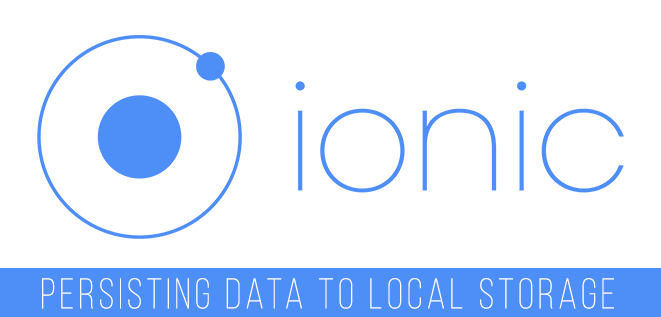

# 使用 Ionic 将数据保存到本地存储中   --   周倍同 

  

文章翻译：周倍同    
发表时间：2015年7月23日     
原文作者：TROY MILES    
文章分类：移动应用开发

## 关于本文   

如今越来越多的移动 App 采用 HTML5 的方式来进行开发，同时还有一部分的 Web App 是通过浏览器来访问的，这就使得用户在离线的状态下无法使用 App 。本文要介绍的就是通过使用 ionic 将数据保存到本地中，实现离线存储，这样即使在离线的情况下用户也能正常使用 App。

## 文章内容   

用户希望移动 App 中某些功能能够简单的运行。如果事情不像他们期望的那样的话，用户会删除你的 App，甚至是给你的产品一个差评。用户希望 App 的设置功能(Settings)能够简单好用。无论何时用户在设置界面做出更改，他们希望这些更改能生效并且正确的保存下去。这样当下一次他们启动 App 的时候，就不需要再重新设置一遍了。  

让一个使用 ionic 代码库开发的 App 一直正确的执行任务不是一件很难的事情，但是这篇文章能帮你避免开发过程中的一些小麻烦。比如说，我们可以使用 ionic 的侧边菜单启动模板再给它添加一个设置界面（本文中使用的版本是 beta 14 of Ionic）。设置界面没有什么特别的地方，但是实际上 App 的设置能在应用的任何地方保存。设置界面只是提供了一个展示全部设置的地方。下面我们就来看看如何保存被用户改变的值。  

我们设置策略的第一部分就是将我们所有的个人设置都保存在 Settings object 中。这是我的一个个人喜好。我的 App 通常都会将 Settings object 中的所有属性顺序化和序列化。任何我想保存一些东西的时候，我就会把它加入到 Settings object 中，系统就会完成剩下的部分。

接下来，我们使用一个 Angular Value object 来保存设置。value（值）是 angular 的提供者，就像工厂、服务、提供者和常量一样。和常量不同的是，values 是可以改变的。所以 value 能让我们很好的保存我们的 settings object ，同时我们输入的值充当默认值。

```javascript
angular.module('starter')
   .value("Settings", {
       searchRadius: {value: "5"},
       acceptsPushNotification: true,
       hasUserSeenMessage: false,
       pagesPerLoad: 20
   });
```

设置策略的基础是 HTML5 的本地存储。本地存储能让网页应用以基于键值对的方式通过字符串来存储数据。如果你还对我们如何存储各种类型的包括字符串在内的数据有疑问的话，不用再多想了。我们选择将所有数据保存在单个对象中的理由是我们能通过使用 JSON 实现单个对象与字符串之间的相互转换。

文件 localstorage-service.js 中只有两种方法在 services API 中。第一个是 serializeSettings，另外一个是 deserializeSettings。两者分别实现的功能和名字的描述一样。在 Local Storage 和 checkLocalStorage 中同样有一个内部唯一的方法。这个方法只用于诊断，因为它只用来将设备有本地存储的位置写入控制台。

Local Storage 做的最后一件事就是在启动的过程中调用 deserializeSettings，并赋予 settings object 上一次存储的值。如何没有任何保存的值，那么就使用存储在 value 中的 Settings object。另外一个需要解释的点就是为什么我们在使用 angular extend 时要复制属性而不是简单的将整个对象拷贝过来。如果我们曾经修改过整个 angular value object，它就会变回到默认值，做出的更改也就失效了。我们可以选择写一个函数来复制这些属性，但是 angular extend 拷贝属性的方式正是我们需要的。

```javascript
function deserializeSettings() {
   var newSettings, rawSettings = localStorage[settings];
   if(rawSettings) {
        newSettings = JSON.parse(rawSettings);
       if (newSettings) {
           // use extend since it copies one property at a time
           angular.extend(Settings, newSettings);
           console.log("Settings restore");
       }
   }
}
```

在 Settings controller 中，我们将 Settings object 中的 values 与界面中的 widget 绑定在一起。将 $scope object 和 Settings object 的属性取成相同名字，会让更新属性值变得更容易，如果我们使用 JavaScript 括号表示法来访问对象的话，我们就能同时访问 $scope object 和 Settings object。当任何一个 widget 的 value 发生改变的时候，onChange 方法就会被调用，然后我们就可以用到之前提到的方法同时访问两个对象。

```javascript
if (!Settings.hasUserSeenMessage) {
   Settings.hasUserSeenMessage = true;
   LocalStorageService.serializeSettings();
   $ionicPopup.alert({
       title: 'Hi There',
       template: '<div class="text-center">You are a first time user.</div>'
   });
}

// set the initial values for the widgets
$scope.searchRadius = Settings.searchRadius;
$scope.acceptPush = Settings.acceptPush;

// when a widget is changed, come here and update the setting object too
$scope.onChange = function (type, value) {
   $scope[type] = value;
   Settings[type] = value;
   LocalStorageService.serializeSettings();
};
```

我们也演示了如何系统的保存变量。在代码中，hasUserSeenMessage 属性会被检查。如果用户没有看见我们发送的一次性消息，我们就会将 value 设为 true，将 value 保存在本地存储中，然后再次显示消息。任何时候你想要保存设置，只要调用 LocalStorageService.serializeSettings 就行了。

> 更多IT技术干货: [wiki.jikexueyuan.com](wiki.jikexueyuan.com)   
> 加入极客星球翻译团队: [http://wiki.jikexueyuan.com/project/wiki-editors-guidelines/translators.html](http://wiki.jikexueyuan.com/project/wiki-editors-guidelines/translators.html)   

> 版权声明：   
> 本译文仅用于学习和交流目的。非商业转载请注明译者、出处，并保留文章在极客学院的完整链接   
> 商业合作请联系 wiki@jikexueyuan.com   
> 原文地址：[https://www.packtpub.com/books/content/persisting-data-local-storage-ionic](https://www.packtpub.com/books/content/persisting-data-local-storage-ionic)   

