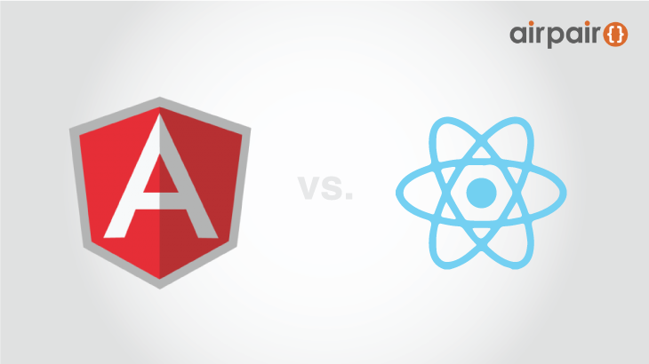

# Angular 与 React 的比拼– 不相上下



发表时间：2015 年 7 月 29 日

原文作者：Amit Kaufman（）

文章分类：Web 开发

## 关于本文
在如今 Web 开发的过程中，我们到需要使用 JavaScript 语言。不同的 JS 语言存在着不同的优劣性，优秀的 JS 语言会降低我们开发时的难度和增加我们产品的质量。Angular 与 React 作为两种常用 JS 语言，存在着各自的优缺点。

## 文章内容

- 1.介绍
- 

不久前，我们的团队必须为 Wix 的旗舰产品选择一种随处可见的网络编辑技术。这是一个及其庞大的单页申请，包含复杂的资金流动，其它内部框架和服务器之间的信息交换，以及许多用户体验。这款产品由40多个开发者共同开发。关于技术的选择是使用 ReactJS 或者 AngularJS 。这两者我们都曾使用过，并且纠结于 Angular 便于操作的编译说明和React的简单。我们展开了一场概念上的证明，最终导致我们得出了一个平分秋色的结果。这篇文章是关于两者之间的对比以及平分秋色的结果。

  - 1.1包装

包装是按照你的想法运行和展开你自己代码的能力。为了达到最快的加载时间，我们想要在最开始加载最小的量并且维持需求。这也让我们能够继续发展新的特性而不缓慢降低加载时间。

Angular 这样做的能力非常有限（主要在 HTML 模板），当我们按照意愿去调整它时，它看上去像代码的堆砌。

简单来说，我们发现 Angular 太僵硬死板。然而 React 并不这样，它是简单的 JS 允许我们使用 requirejs 去加载部分代码。它也允许与其他解决方案一同工作，例如 webpack.

获胜者：React

 - 1.2	学习曲线

每个人知道想要掌握 Angular 的道路是崎岖不平的：刚开始学的时候很容易，随着你的深入学习会变得越来越困难，就好像婚姻一样…

我们发现，仅仅用一周的时间，你就可以把 React 学到一个很高的水平。想要习惯这单一的过程需要一些时间，特别是对网络开发者，但是一旦你坚持做了，就会变得简单起来。

Angular 的生存周期是复杂的，想要掌握它，你真的需要读代码。编译和连接并不是靠直觉，一些特殊的情况可能让人困惑不已（编译时的循环，指令间的冲突）。另一方面，React 仅仅拥有一些生存周期方式，并且它们可以自行解释说明。据我们的了解，React 最好的特性就是从不，至多一次使得我们不得不读它的代码。

获胜者：React

- 1.3	抽象性

良好的抽象性是极其重要的。抽象性提供了快速的发展以及隐藏了那些对于开发者不需要查询的详细说明。

我们发现 Angular 的抽象性是存在漏洞的。这表示为了使用它工作，你需要了解最根本的模型。这就是为什么大多数人在调试他们的代码时需要修改Angualr 的内部结构。

为了弥补这些漏洞，提出了一些概念，例如指令优先级。但是当我使用的指令来自三个不同的版本，我要如何控制优先级？我为什么有关注这个?为什么不同的指令有时不能在相同的网页代码上良好地一同运行？为什么我需要知道消化周期?

React 的抽象性表明它在一些地方是不太灵活的，例如不能在网络标签中增加属性，或者在组成部分中增加标签。这些都被 React 混合类的实现给解决了（混合类允许仅在生存周期内重复，并且有可预测的执行命令），并且不存在漏洞（就像我上面提到的，我们从来不需要看它的代码）。

获胜者： React

- 1.4	模型的复杂性

通过模型的复杂性，我正在提及你所构造的之后形成可视化的数据模型。

由于 copy-n-compare ，Angular 的性能在处理范围内是敏感的。这要求你不能使用大型的模型。关于这个有赞同者也有反对者。赞同者认为它使得代码更加简单并且可测试；但是反对者认为它迫使你拆分你通常使用的东西，之后再重建它（以服务要求为例）。

React 让你可以自由去选择，不用考虑性能的优先级。结果通常取决于你是否是一个优秀的程序员。

获胜者：不分高下

- 1.5	调试

当程序不运行时，我们总是开始繁琐的调试工作。我将这个分解为两个情况——认识你的逻辑部分不运行的原因，以及了解 HTML 伴随着产生它的东西而输出。

Angular 是一个被动的事件系统，它总是写起来很容易，但当堆栈轨迹结束比你预想的更长以及不同时，调试起来很困难。但是，Angular 在提供逻辑结构方面做得十分出色，例如服务器。如果使用正确，它们使得代码的测试和调试变得更加简单，但是任何优秀的程序员都会试着将代码和逻辑分离开。

当 Angular 的指令不运行时，一种选择是用一种不同的方法来重写代码，因为有如此多的编码在运行。另一个选择还调试 Angular 的代码——不是一个繁琐的工作。

React 有两个重要的情况——更新模型/由于用户事件执行其它动作；单方面的翻译掩盖总是相同的部分。这表示只有相当少的平台来搜寻你的漏洞，并且堆栈轨迹在 React 的代码和你自己的之间有很清晰的区别。它们通常不混合。React 也拥有很少的编码，并且它集中在同一个地方——虚拟网络的对比。它是一个暗箱，但在我们的经验中，它总是如预期般工作。

当谈论到 HTML 的理解，以及代码的回溯，结果是相反的。在 React 中，为了产生 HTML 是很那比较代码的。甚至使用 jsx，当“如果”和“重复”控制将HTML 碎片变成小块样本时，你可能几乎不比较它们。在 Angular 中，结果却极其类似 HTML 的模板。

获胜者  
JS：React 

HTML：Angular

- 1.6	绑定

在 Angular 中，你仅仅可以绑定范围。这说明，在复杂的情况下，例如绑定一个服务器/非同步服务器，或者当绑定一个大型的模型时，你需要有一个媒介模型，并且你需要处理消化周期以及明确时间。

对比而言，React 仅仅提供好的语法来绑定，这叫做价值链（“value”性能和“onChange”性能的一个单一属性）。这个概念很简单，它听上去好像没有工作，但实际它做了。并且如果你清楚地了解它后，你将能够创照你自己的链接声明或者相似的可以回复你所有绑定需求的功能。

获胜者： React

- 1.7	功能调整

React 控制自身功能十分简单。如果你进行成分更新，你可以选择你喜欢的对比关系——模型或者介绍。如果你的模型比较简单，只要让 React 在虚拟网络上做对比就行。如果你的模型很复杂，或者你创建了许多文档模型，你可以用这个功能的实施习惯来优化它，在这里你可以设计自己的脏查找原理，这是十分有效的。

在 Angular 中，你需要开始计数范围（有许多可以为你所用的公共程式），在一些情况下，你仅仅需要在纯粹的 js 中实施一个元件的内部结构，并且为了便利用 Angular 包裹它。最有力的证据就是你能找到的关于 Angular 功能调整的文章的数量。

获胜者： React

- 1.8 代码复用

Angular 的优点就在于它能够把需要用到的所有资料全部准备好。然而，由于命名空间和优先级冲突的原因，我们并不需要从不止一个供应商那里使用 Angular 函数库。 React 能够让你用自己喜欢的方式管理它。也就是说， Angular 依旧占据很大的市场，而且能提供更多现成的资料。

胜利者：不相高下

- 1.9 模版

我将最重要的一个留到了最后…… 虽然绝大多数有关 Angular 或者 React 的文章都在讨论指令或者数据流，但现实是80%你所编写的在线服务都是用户界面。我把它们叫做面板，也就是应用逻辑的构件。它们包含了大量的信息流和制定流程，并被用于使用现成构件。但通常面板并不是能够被重复使用的，它们是我们的用户能够看见和接触最多的部分。 React 对于这些来说不是较好的选择。在编写中继器的时候，它会如下所示：


```

    var createItem = function(itemText) {
        return <li>{itemText}</li>;
    };
    return <ul>{this.props.items.map(createItem)}</ul>;


```               

想要从类似的帖子中学到更多？[订阅了解更多!]()

而在 Angular 里如下图：

```

    <ul>
        <li ng-repeat="item in items">{{item}}</li>
    </ul>


```

想要从类似的帖子中学到更多？[订阅了解更多!]()

这样有多好呢？（答案是：很多）因而，Angular 在这一部分的比较中是显而易见的胜者。

胜利者：Angular

- 2.连接断路器和react模版
- 

那么，我们怎么解决这场争论呢？我们如何利用好上述 React 的所有优点，却又并不遗漏 Angular 的最重要的特征呢？我们决定试一试来解决这个问题。

对于工具的设计考虑如下：

- 任何有效的超文本标记语言几乎都是一个有效的 React 模版，我们遵守事件注释骆驼拼写法（或案例），如 React ，和无价值属性的注释，如失能（真、假价值将决定它们是否会在 DOM 中出现）；
- 用花括号和里面的指令，从 HTML 语境转换到 JS 语境；
- 转换不能在运行时间内，所以它不能影响执行。对于作用域或执行时间代码没有额外的目标，只用 JS 的本地架构（闭包、方法和本地表达）来实现功能；
- 使生成代码尽可能地成为人类能从语法上分析的代码；
- 这些由 Angular 和 JS 产生出的指令应当使那些拥有较强 Angular 背景的人员一目了然；
- 保证它短小精悍。只有在有合理的理由时才需要添加指令。（整个转换器要在350行代码内）。
 
结果就是[令人惊奇的 React 模版](http://wix.github.io/react-templates/)。我们获得了 Angular 模版的优势，同时拥有了 React 的简易！我们得到了表达与逻辑之间的完全分离，模版的声明性编写，并使它更有用。我们增加了模式载入程序支持（AMD，或Common JS），以便于模版中其他组件的重复使用。让我们用一些案例来看看它的简洁之处。

 - 2.1 集合迭代

```

    <ul>
        <li ng-repeat="item in items">{{item}}</li>
    </ul>


```

想要从类似的帖子中学到更多？[订阅了解更多!]()

注释： `索引`来自于属性名项目，被用来允许使用嵌套中继器的目录。

- 2.2 IF语句

```

    <label rt-if="this.hasError()">{this.getError()}</label>

```

想要从类似的帖子中学到更多？[订阅了解更多!]()

注释：这是一个真实的`IF`句， 意思是如果表达是假的，将完全不会渲染节点。

 - 2.3 糖衣语法、RT级，RT范围，属性的表达
 

```

	<div rt-scope="this.getUserDetails() as theUser" 	title="{theUser.loginName}">
    	Real Name: {theUser.firstName} {theUser.lastName}<br/>
    	Login: {theUser.loginName}
    	Last paid at: <span rt-class="{status:true, overdue:this.isUserOverdue(theUser)}">{theUser.lastPaid}</span>
	</div>


```

想要从类似的帖子中学到更多？[订阅了解更多!]()

注释：因为想要保持它的简洁性，我们已经尽可能地不创造太多属性。我们只添加了一些能够创造价值的成分。

- 2.4 嵌入

```

    <div>{this.props.children}</div>

```

想要从类似的帖子中学到更多？[订阅了解更多!]()

注释：真的很简单……

- 2.5 处理事件

```

    <div>
    <div rt-repeat="task in tasks" style="font-weight:{task.selected ? 'bold' : 'normal' }" onClick="() => this.toggleTask(task)">{task.title}</div>
    <button onClick="{this.save}">Save</button>
	</div>

```

想要从类似的帖子中学到更多？[订阅了解更多!]()

注释：这是 React 模版最佳优势之一。我们生成了方法，这样你就不需再向 DOM 或工作目录中存储任何东西。你可以只编写逻辑代码，继续向你的目的研究。我们提供有2个选项： Λ表达式，或者如果{}符号被使用，它是一个可以返回函数指针的表达式。最终，以 camelCase 事件名为开始的常规操作，所对应的常用属性可以使用这两种符号。

- 2.5 下载模板资源

```

    <rt-require dependency="./utils/translate" as="tr"/>
	<rt-require dependency="./comps/colorPicker" as="colorPicker"/>
	<form>
    	{tr('Enter_Your_Name')}: <input type="text" valueLink="{this.linkState('name')}"/><br/>
    	{tr('Choose_Favorite_Color')}: <colorPicker valueLink="{this.linkState('favColor')}"/>
	</form>
```

想要从类似的帖子中学到更多？[订阅了解更多!]()

- 2.6 其他的优势

它的类型就相当于在超文本语言中，这就意味着关键词不必用骆驼拼写法翻译，（像是 React 框架中要求的），你可以像其他任何情况一样用｛｝符号来插入语言，"class"属性也可用（不用将其称呼为类别名称或 className） 

- 3 总结
- 
Angular 和React 两种框架都很强大，我们很难在其中选择一种去用  Angular 框架不会被改变，这就使得它在适合你的方案进程的情况下变得很好用，React框架可以让你自由去改变并且很简单，但又缺少了 Angular 框架的规约力。然而，当你使用 React 模板时，你会用到 Angular 模板中受我们所喜欢的东西，同时又不会感觉到 Angular 模板中麻烦的东西。对于有复杂项目要设计的人，想要制作文件包的人，或是要用框架与其他库进行连接的人，我们认为 React+React 模板共用是最好的选择。

Amit Kaufman 是 Wix 的主编，资深开发者，管理者以及企业家。  

> 更多IT技术干货: [wiki.jikexueyuan.com](wiki.jikexueyuan.com)   
> 加入极客星球翻译团队: [http://wiki.jikexueyuan.com/project/wiki-editors-guidelines/translators.html](http://wiki.jikexueyuan.com/project/wiki-editors-guidelines/translators.html)   

> 版权声明：   
> 本译文仅用于学习和交流目的。非商业转载请注明译者、出处，并保留文章在极客学院的完整链接   
> 商业合作请联系 wiki@jikexueyuan.com   
> 原文地址：[https://www.airpair.com/angularjs/posts/angular-vs-react-the-tie-breaker](https://www.airpair.com/angularjs/posts/angular-vs-react-the-tie-breaker)

