# 15个很有用的面向设计师的 UI 和 UX 设计工具及资源 --邵凯阳

  

文章翻译：[邵凯阳]()

发表时间：2015年7月25日  

原文作者：Prat  

文章分类：产品与设计

## 关于文本
伴随着移动打印和网络设计的快速发展，以及客户对用户界面和用户体验的越来越苛刻要求，对设计师的要求也越来越严格，一个好的设计工具必将成为一个优秀设计师的一把利器。本文就主要介绍了现在在 UI 和 UX 设计领域比较有用的15款设计软件，其中包含了对各个软件的整体功能的总结，以及各个软件的官网链接。
## 文章内容
今天，[平面设计师](http://codecondo.com/what-do-graphic-designers-do/)在各个设计领域有多重的机会。以后，通过各种移动打印和网络设计过程，设计师将进入 UI 和 UX 设计的世界。与其他创造性的事务不同，像标志设计、2D/3D 动漫、图形信息、动态图像和其他，UI 和 UX 的设计是非常不同的。用户界面 (UI) 设计是开发一个用于人机交互的前端界面的过程。然而[用户体验 (UX) 设计](http://codecondo.com/5-user-interface-design-principles/)涉及学习各方面的人机交互知识，例如交互的可用性、交互的功能性、交互设计、信息架构设计等。

在用户界面 (UI) 设计方面，平面设计师能够将自己的创造性想法注入到一个项目中去。它涉及到使用各种视觉元素，例如颜色、符号、过渡效果、图像等。通常情况下，UI 和 UX 的设计师是以团队的方式来定义和开发界面特性以及它的功能性和提供用户与应用程序或网站之间的通信模型。当然，还有系统工程师、信息技术专业工作者和其他设计者都对设计流程作出了贡献。

那么，对用户界面和用户体验发展至关重要的诸多方面是什么?我已经列出了其中一些:

- 创建网站线框图。  
- 定义的交互模式。  
- 开发导航地图。  
- 创建图形的版面编排。  
- 测试功能。  
- 引导用户测试。  

[设计师使用各种工具](http://codecondo.com/14-essential-designing-tools-which-every-graphic-designer-must-know/) 和资源来使任务很好的完成。有一系列的测试、原型设计、仿真和其他促进 UI 和 UX 设计过程的工具。我已将这些能够对设计者的发展提供帮助的在线工具和资源编辑成了一个列表。好了，那就来看看下面列表中为设计师设计的15款 UI 和 UX 设计软件。

### 1) [Proto.io](https://proto.io/)
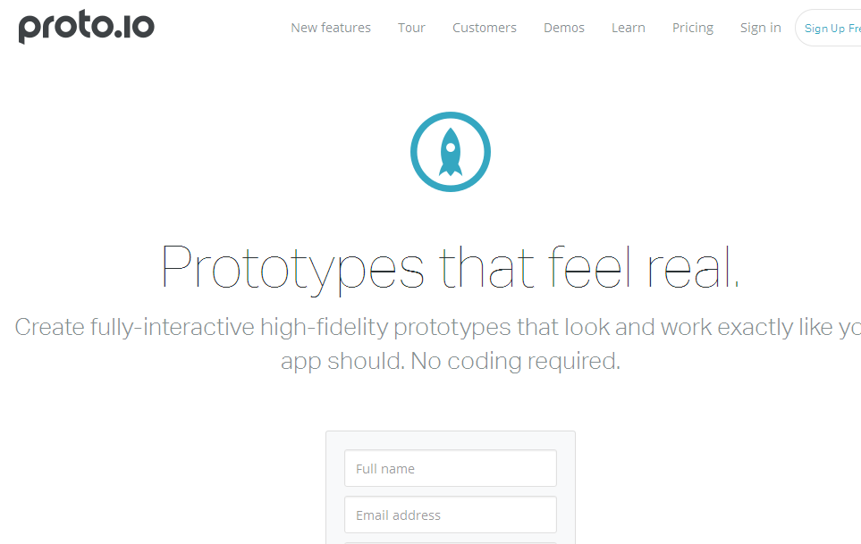  

Proto.io 是一个用于应用程序开发的原型设计工具。它收集了大量的 UI 库，以及交互式 UI 组件来实现材料设计功能。该工具还提供一些其他的特性，例如颜色调整、筛选器、多文件上传等功能。当设计团队工作时，Proto.io 与 DropBox 还可一起同步为设计人员提供实时在线协作功能。

### 2) [Pidoco](https://pidoco.com/en)
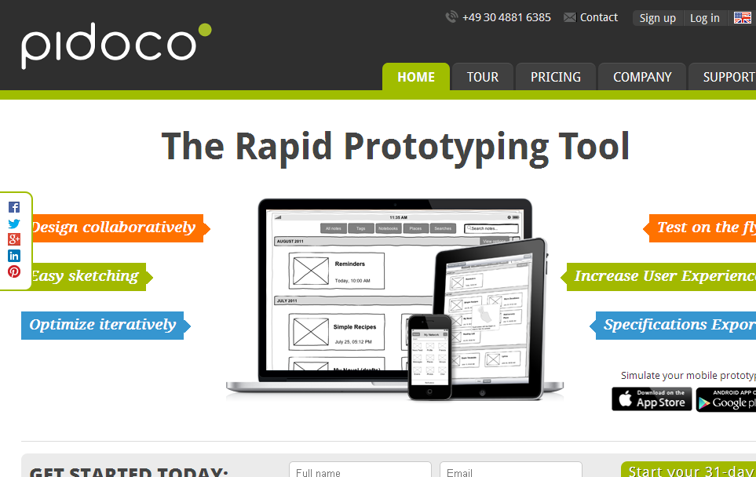  

Pidoco 是一个用于 web、移动和企业应用程序开发的现代原型应用程序。它提供了基于云计算的开发线框图，移动模拟、实物模型和 UX 原型平台。应用程序提供内置模板便于快速进行原型设计，以及提供实时协作功能。使用 Pidoco，你可以开发交互式原型以及实时移动模拟运行 iOS 和 Android 设备。

也可以参看: [对想要挣钱的设计师的5条建议](http://codecondo.com/tips-for-designers-to-earn-more-money/)

### ３) [InVision](http://www.invisionapp.com/)
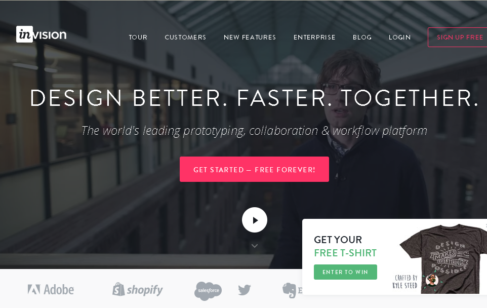  

InVision 是一个将静态设计转换为具有交互式原型设计功能的有力工具，例如可以动画、手势和转换场景的实现。该工具提供一个基于云计算的平台，允许在开发移动和企业应用程序时进行实时协作。InVision 也支持为苹果手表和 Android 穿戴开发原型。

### 4) [UserTesting](http://www.usertesting.com/)
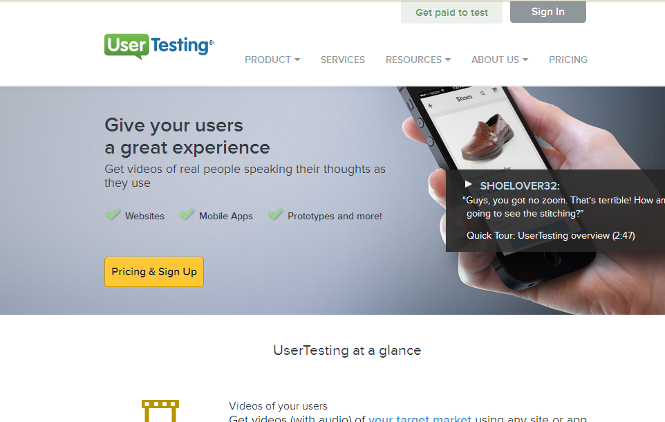  

UserTesting 是一个现代的测试工具，用于在台式机、平板电脑和移动设备上测试网站、 应用程序、原型等。该工具是一个用户研究平台，可以让你的目标受众测试您的网站或应用程序。UserTesting 通过视频、指标、统计数据等形式从目标受众群体中收集有用的反馈。

也可以参看: [检测你网站用户体验设计的十大工具](http://codecondo.com/ux-tools-for-analyzing-websites/)

### 5) [PowerMockup](http://www.powermockup.com/)
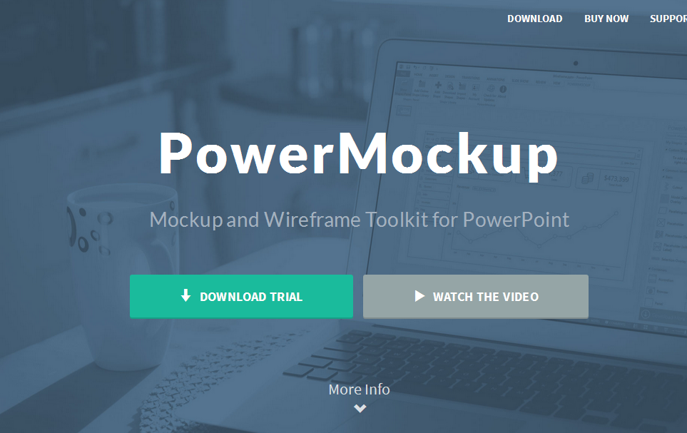  

PowerMockup 是一个专门为在 PowerPoint 中使用的强大的模型和线框工具。该应用程序在 PowerPoint 形状设计收集了广泛的 UI 组件。这些元素可以在 PowerPoint 中创建各种移动、网络和桌面应用程序的界面原型。PowerMockup 还提供了一些强大的协作和共享功能。

### 6) [PickFu](http://www.pickfu.com/)
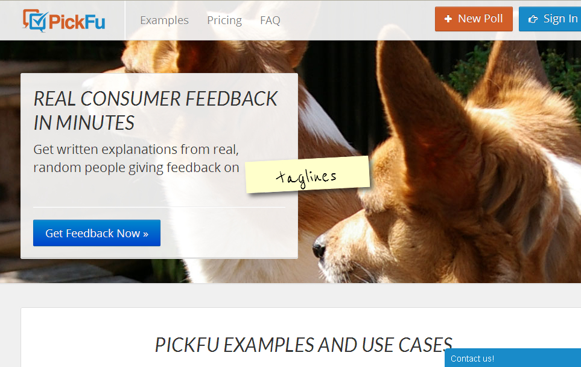  

PickFu 是一个轮询平台，可以帮助你找到方案设计和营销理念过程出现问题的解决方法。它是一个强大的工具，可以收到来自美国总部对于商标、书籍封面、UI 模型等的各种设计思想的建议、意见和反馈。

### 7) [Myna](https://mynaweb.com/)
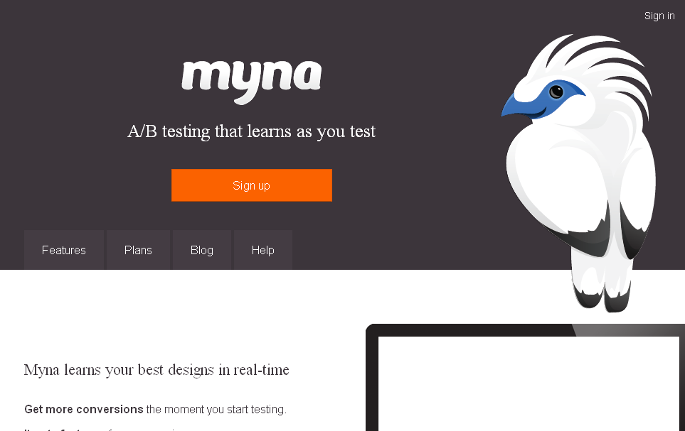  

Myna 是一个强大的被图形设计师和 web 开发人员使用的 A / B 测试或拆分测试工具。该工具对个别游客进行检查，并从不同的角度对您的工作提供有见地的反馈。您可以使用Myna 进行网页设计、电子邮件设计、广告设计、 UI 设计等。

也可以点击: [面向网页设计师的24小时免费模型和线框图工具](http://codecondo.com/free-wireframe-tools/)

### 8) [Ace UI](https://visualhierarchy.co/shop/ace-ios8-mobile-ui-kit/)
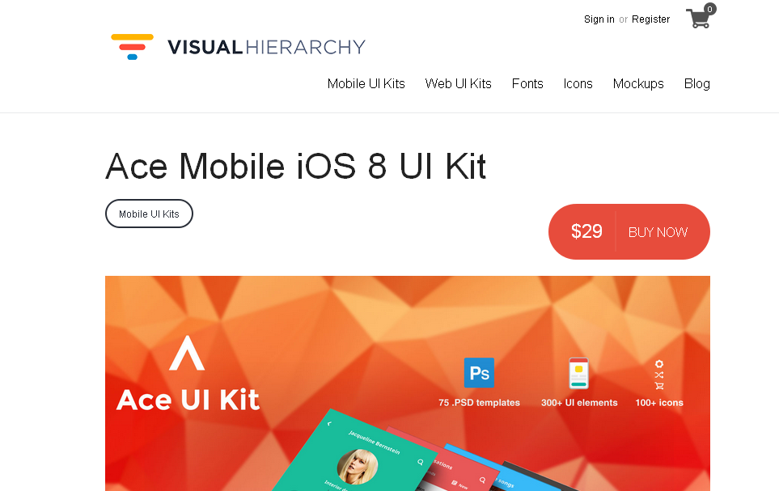  

Ace UI 是一个移动的 UI 工具包，是专门为 iOS 8 移动应用程序开发设计的。它提供了大量的字体类型、图标、 PSD 模板和其他 UI 元素集合。此外，它还提供线框和原型工具包，可以进行更高效的应用程序开发。

### 9) [Form](http://www.relativewave.com/form/)
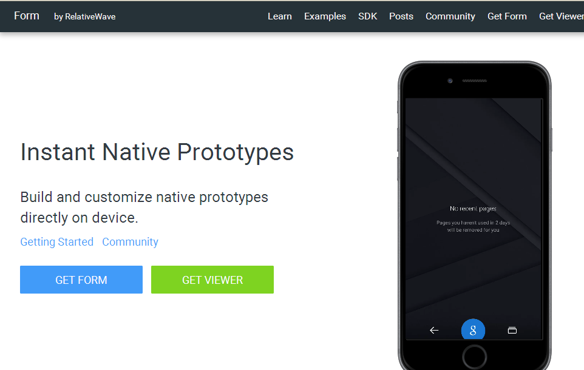  

Form 是一个很强的原型工具，允许您直接在设备上构建和自定义本机原型。该工具提供了最新的材料设计组件，以及允许您构建自定义组件。

### 10) [MouseStats](http://www.mousestats.com/)
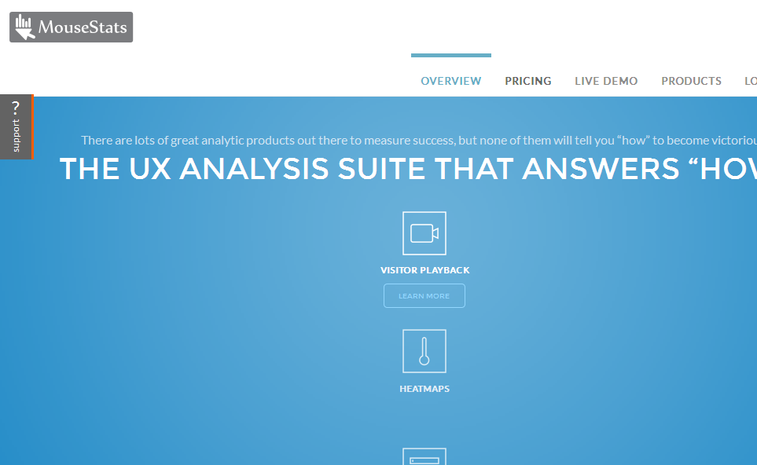  

MouseStats 是一个很受欢迎的 UX 分析工具，它提供了各种现代监测用户与网站的交互功能。该工具提供各种服务，如浏览会话视频录制、滚动热图、统计数据、测量等。

### 11) [POP](https://popapp.in/)
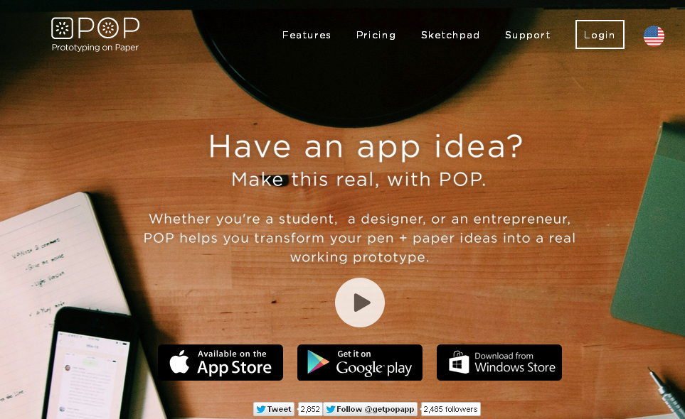  

POP 或纸上原型是个很酷的应用程序用于将手工制作草图和版面编排转换为交互式原型。应用程序在各种平台和设备上都可以工作，以及与 DropBox 一起实现实时集成协作。

### 12) [Gliffy](https://www.gliffy.com/)
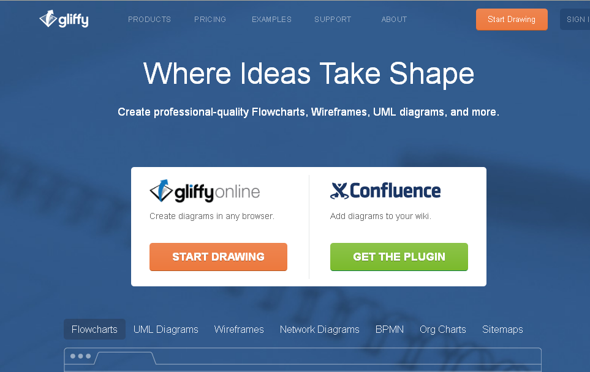  

Gliffy 是一款具有专业设计与在线协作功能的应用程序。该工具允许您设计专业图、 技术图、线框图、流程图、网络图、站点地图等。

### 13) [Antetype](http://www.antetype.com/)
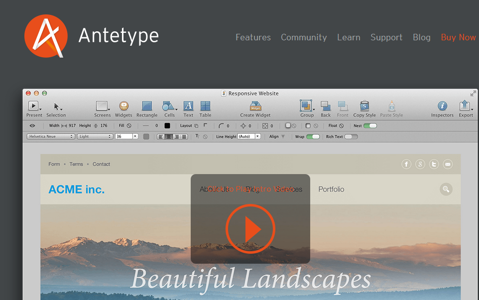  

Antetype是一款开发交互式用户界面原型的应用程序。该应用程序提供超过 400 个主要平台的预设计部件。它提供了一些特性功能，如动态布局、 响应设计的功能、属性绑定、断点、演示文稿模式、嵌套、注释等。

Also Read: [10 Web Design Trends for 2015](http://codecondo.com/10-web-design-trends-for-2015/)

### 14) [Wirify](http://www.wirify.com/)
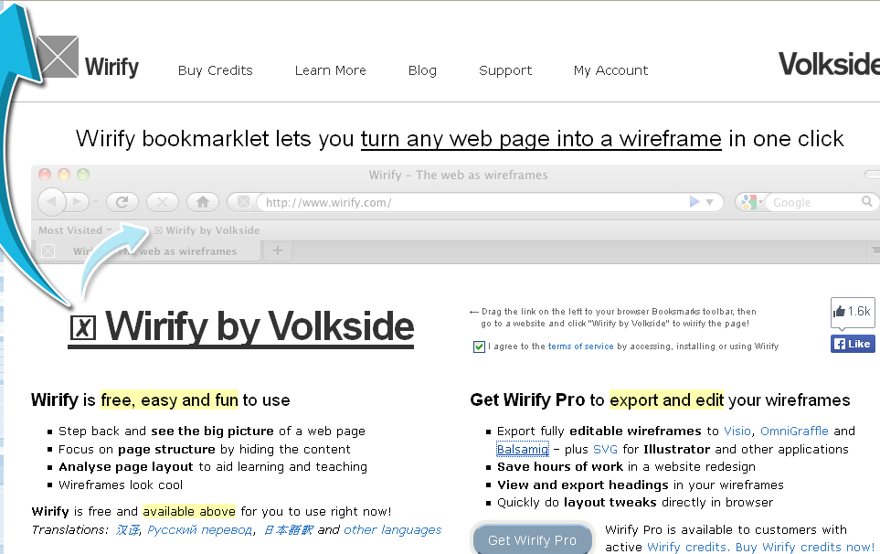  

Wirify 是一个强大的 UX 工具，通过一次点击就可以实现从 web 网页到线框图的转换。该工具允许您检查各种网站的页面结构和布局。此外，你可以编辑你的线框图，并将它们导出到其他的设计应用程序，例如 [Balsamiq](https://balsamiq.com/) 或 [Omnigraffle](https://www.omnigroup.com/omnigraffle/)。

### 15) [Naview](http://www.naviewapp.com/)
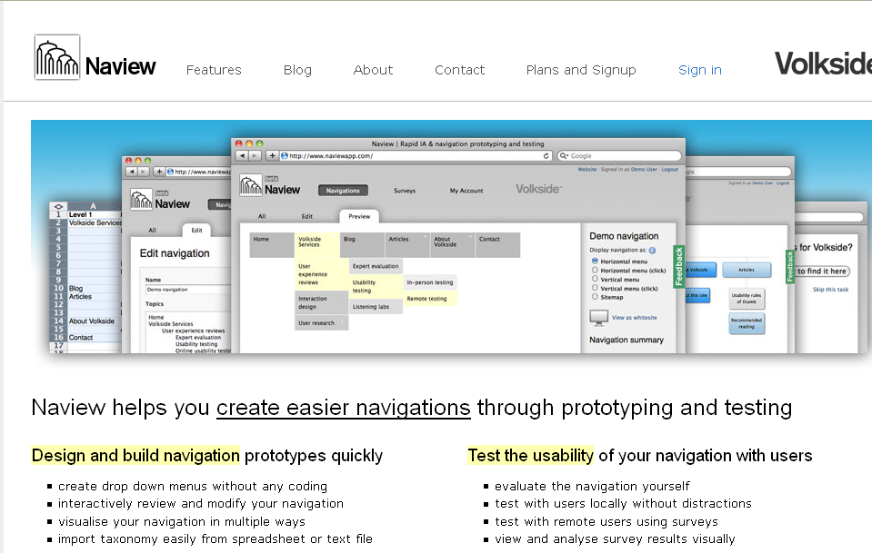  

Naview 是一个强大的工具，用于设计导航原型和测试导航的可用性。使用 Naview，您可以预览信息体系结构和网站地图。此外，该工具允许您开发下拉式菜单以及直接在浏览器中编辑导航结构。

### 结论
在 web 世界中有三种图形用户界面被使用。他们是工具用户界面、 桌面用户界面和进程用户界面。用户界面和用户体验设计领域正日益受到更多关注，因为计算机技术在各行业中越来越多的得到应用。我们期待在不久的将来可以发布更多的开发网站的用户界面和用户体验的工具和资源。

现代的 UI 和 UX 工具拥有内置的功能和特点，在很大程度为设计师完成他们的项目提供了帮助。这些工具也带来了一些创新成果，可以对用户界面和用户体验进行可视化和功能方面的开发。

该列表包含了当前对用户界面和用户体验设计有价值的工具和资源。如果你最喜欢的工具没有被记录在名单上，然后你可以明确的下面的评论区中提出。祝你好运！

> 更多IT技术干货: [wiki.jikexueyuan.com](wiki.jikexueyuan.com)  
> 加入极客星球翻译团队: [http://wiki.jikexueyuan.com/project/wiki-editors-guidelines/translators.html](http://wiki.jikexueyuan.com/project/wiki-editors-guidelines/translators.html)  

> 版权声明：  
> 本译文仅用于学习和交流目的。非商业转载请注明译者、出处，并保留文章在极客学院的完整链接  
> 商业合作请联系 wiki@jikexueyuan.com  
> 原文地址：[https://www.packtpub.com/books/content/persisting-data-local-storage-ionic](https://www.packtpub.com/books/content/persisting-data-local-storage-ionic)  
