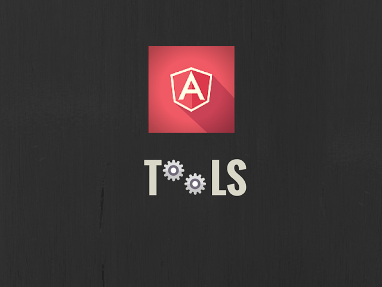

# 20 个有用的 Angular.js 工具

文章翻译 ：[杨旋](https://github.com/yangxuanxc)

发表时间：2015 年 7 月 23 日

原文作者：Leena Joseph 

文章分类：web 开发

## 关于本文

本文是针对 Angular.js 开发者而写，在本文中，作者介绍了 20 种实用的 angular.js 工具 。其中包括了开发所用的 IDE，测试工具，库文件以及扩展工具。俗话说“磨刀不误砍柴工”，在使用一项开发技术进行开发之前，应该先学习下支持该技术的工具，这样能使你事半功倍。

## 文章内容

喜欢使用 Angular.js 吗？我们已经为开发人员收集了一些非常好的 angular.js 工具以便开发人员使用，为了让开发人员在使用 angular 进行开发的时候使用这些工具来保持一个高效率的状态。

[Angular.JS](http://www.fromdev.com/2015/07/why-angular.html) 框架已成为用动态方式设计 web 应用程序的开发人员使用的框架之一。假如这里有一些 angularjs 开发人员即将开始做一个 AngularJS 项目，他们可能需要使用许多工具并以一种成熟的方式来开发一个网站。

Angular.js 的初学者可能想在开始使用它之前读一些好的关于 [angular.js 的书籍](http://www.fromdev.com/2015/06/best-books-for-angularjs.html)。

我们制作了大量的 [angular.js 在线学习教程](http://www.fromdev.com/2015/06/angular-js-tutorials-pdf.html)。

为了减轻使用 AngularJS 开发的负担，这里有几个很棒的工具，包括测试、 前端开发、 编辑、 库、 扩展、 模块、 代码生成器、 以及网格工具。

### 开发 Angular.js 最佳的 IDE

下面列举了一些开发人员最需要的集成开发环境 (IDE) 和 Angular.js 的轻量级文本编辑器。

#### [Webstorm](https://www.jetbrains.com/webstorm/)

Webstorm 是一个非常出色的代码编辑器，它彻底的适配项目并且为建立各种类型的网站都提供了高质量的编码。它支持当前最新的网页开发技术。每个使用此 IDE 工具进行开发的 web 项目，它都很好的结合了每一个细节并且简化了创建网站的工作流程。

#### [Aptana](http://www.aptana.com/)

Aptana 是有助于用敏捷的方式创建 web 应用程序的集成开发环境。如果要在 AngularJS 中使用此 IDE 编辑器工具，您需要从 Eclipse 市场激活 AngularJS Eclipse 扩展。

#### [Sublime Text](http://www.sublimetext.com/)

Sublime 对 AngularJS web 开发人员而言是一个比较便利的文本编辑器。通过使用几个快捷键，它有助于我们在编码区域内达到目标点。它具有高度适应性并且可以定制任何类型的编译环境。它还可以按照您的意愿进行拆分编辑。可以轻松的在各个项目之中切换，它会自动的存下每个项目中的所有改动。

### Angular.js 专用测试工具

不管是使用 Angular.js 或者任何其他的软件，测试都是开发过程的重要组成部分。在使用 Angular.js 开发的过程中，下面的工具可以帮助您简化测试过程。

这些工具可以和 [javascript 在线测试工具](http://www.fromdev.com/2015/01/websites-to-test-javascript-code.html)很好的契合。

#### [Protractor](http://angular.github.io/protractor/#/)

Protractor，一种端到端的测试框架，当它和 AngularJS 一并使用时，它运用了一种完全自动化的测试方式。它通过在真实的浏览器中运行您的应用程序来进行测试。它适用于像 WebDriver、Mocha、 jasmine、 Node.js，selenium，cucumber 等伟大的技术。

它自动的与 AngularJS 应用程序进行通信，一旦所有被挂起的 web 页面的任务都完成了以后，你不需要使用一个等待或睡眠命令来进行测试。

#### [Jasmine](https://github.com/jasmine/jasmine)

Jasmine 是一个行为驱动开发框架，它是专门为 JavaScript 用户定制的。它一般会使用函数来构建您的测试并且一直维护它直到结束。可以通过使用一个单一的多功能一体包来完成任何类型的测试，这也是它的主要优点，使用一种简单的方式来测试您的程序。

这个框架也有一个缺点，就是它并不知道在哪个平台 (浏览器) 上运行。不过可以通过同时使用 Karma 来克服这个缺点。

Karma 也是一个测试框架，在和 Jasmine 一起工作时可以作为一个测试运行程序来高效的测试应用程序。

#### [Code Orchestra](http://codeorchestra.com/#/)

它绝对是一个有助于建立和测试您的 web 应用程序的前端开发工具。当您在实时的编写代码的时候，COLT 通过给您提供建议来修改代码，并且把以统一的格式编写好的代码进行存储。通过使用这个工具，已经编辑好的代码将自动的反映在运行的应用程序中。

### Angular.js 最好的库

下面是一些有用的库，开发人员通过使用它们可以很容易的增强 angular.js 框架的使用效果。请不要尝试去开发一个相同的库，因为已经有人把它做好并且开源了。

#### [CodePen](http://codepen.io/lsgrrd/pen/pnvwf)

对于所有使用 HTML，CSS 和 JavaScript 进行开发的前端开发人员来说，CodePen 是一个完美编辑器工具。这个工具缩短了开发 web 前端页面的创建、 测试和完善网站等单调乏味的过程。它是一个同时协作的编码环境。

Web 开发人员可以专门对跨平台进行实时的查看。它在浏览器代码的编辑器中的可以自动快速的上传多种文件。在这方面它帮助 web 开发人员实现了更快速的开发。

#### [Angular Fire](https://www.firebase.com/docs/web/libraries/angular/index.html)

在 AngularFire 的帮助下创建后端的 AngularJS 应用程序已经变得非常便捷。AngularFire 已经正式支持将 AngularJS 绑定上 Firebase。Firebase 是一个基于云计算的平台，可以方便地与实时应用程序进行集成以及快速的创建后端。

当 Firebase 和 AngularFire 相结合时，它们可以更快的实现数据同步并且提供了卓越的用户管理服务。它还将呈现数据绑定、 用户身份验证，以及静态承载这三方面内容。

#### [AngularUI](http://angular-ui.github.io/)

AngularJS 很著名是因为它可以很有效的创建单页面应用程序。为了创建这些应用程序，我们需要一个路由设施。正好 AngularJS 框架有一个很全面的 UI 组件，它被俗称为 ui 路由器。它提供了一个轻松的导航，也可以根据应用程序的状态而不仅仅是基于路由 URL 来更改视图。

在 AngularUI 中还有很多其他使用原始指令的 UI 组件，比如 ui-地图、 ui-日历以及 ui-引导。这些 UI 组件和指令可以帮助你更快的建立网站。

#### [UI Bootstrap](http://angular-ui.github.io/bootstrap/)

UI Bootstrap 是一个非同寻常的 AngularUI 组件，它有助于为智能手机创建易于使用和理解 web 应用程序。通过使用 AngularJS 的本地指令，该 UI 组件将给予你 Twitter bootstrap 的所有权限。

### 有用的扩展和 Angular.js 工具

下面是一些可用于特定的应用程序的 Angular.js 扩展。

#### [Ng-Inspector](http://ng-inspector.org/)

在 ng-inspector 扩展工具的帮助下，我们可以创建一个检查控制菜单来创建调试和理解  AngularJS 应用程序。它也是一个杰出的可以适用于火狐、Chrome 和 Safari 的浏览器扩展工具。

它很容易与您的应用程序进行交互，并且在您的应用程序中更新每一个实时的操作。它也可以监视整个作用域的层次结构，型号、 类型和值。此工具也显示突出的 DOM 节点当它们指向各自的作用域的时候。

#### [AngularJS Batarang](https://github.com/angular/batarang)

使用 Chrome 特有的扩展工具 AngularJS Batarang 来调试您的 AngularJS 应用程序。它能帮助您提高应用程序的性能。当在进行性能优化的时候它也能测量应用程序的进展。

#### [Restangular](https://github.com/mgonto/restangular)

Restangular 是 AngularJS 独有的服务，它可以帮助您轻松地处理不同类型的譬如 get、 post、 delete 以及从数据库取数据的请求。对所有的用于从 RESTful API 中大量清除数据的 AngularJS 应用程序而言是一个很好的选择。

一个有用的工具 -- Generator Angular

#### [Yeomen Generator](https://github.com/yeoman/generator-angular)

您可以使用合理的默认值和最佳做法来启动一个项目。像要建立这种 Angular 应用，Yeomen 生成器工具是非常好的助手。它仅仅使用几个终端命令就能加快 AngularJS 应用程序的开发过程。

这个生成器将会独自获得应用程序中的信息而避免其他程序获得，并且帮助创建和检测这个应用程序。

#### [Angular Deckgrid](http://andrekoenig.info/angular-deckgrid/#/)

Angular Deckgrid 给您的应用程序提供高度响应和优秀视图，可以适应不同的便携式设备。这个轻量级的“砌体类网格”工具也有助于创建一个灵活的网格用来以一种高效的方式展示照片。

#### [Radian](http://radian.io/)

当我们使用 Radian 这种卓越的框架时，我们只需要进行很少的设置就可以在 AngularJS 中启动一个 web 应用。它是多开发人员协作项目的最理想的选择。

#### [Lumx](http://ui.lumapps.com/)

当您想要用一种快速和容易的方式来创建一个简单而优雅的应用程序的时候，Lumx 将给你提供帮助。此响应式前端框架是基于 AngularJS 和谷歌材料设计规范开发的。此工具内含最新的技术，如 Sass 预处理器、 AngularJS 和 jQuery，将有助于大大提高 web 应用程序的性能。

#### [Angular Gettext](https://angular-gettext.rocketeer.be/)

你可以使用英语中来编码然后在需要被翻译的部分进行一个特殊的标注即可。Angular Gettext 工具会比较容易的自动翻译被标注的部分。这是 AngularJS 中一个简单但功能强大的翻译支持工具 。

#### [NgDocs](https://play.google.com/store/apps/details?id=com.wbyoko.ngdocs)

通过使用 AngularJS 框架内置的 ngDocs 工具来制作文档和引用将使您的应用程序更容易的工作。这个基于安卓的工具对于新手来说也可以比较轻松的通过专门的教程来学习。

#### [NgTables](http://ng-table.com/#/)

不管是简单还是复杂的 web 应用程序，使用 AngularJS 框架支持的 ngTables 工具来创建并管理一张表是十分容易的。通过这个工具，你可以灵活的操作这张表，比如执行排序、筛选和分页等操作。

这个工具也支持自定义筛选器选项，带有分组，外部控制数据，回调函数以及许多其他功能的表。充分利用这一工具来高效的执行这些功能吧。

讲到这就结束了，这些是对于轻松地创建任何类型的 AngularJS web 应用程序最有用的工具。使用这些工具来高效的创建你的 AngularJS 项目吧！

希望找此列表对您有用。如果在此列表中找不到这些工具，那么请在评论栏中提建议，我们将尝试去引用它。

我是 Leena Joseph。我是一个充满激情的 [angularjs 开发人员](http://www.agriya.com/services/angularjs-development)，我和 Agriya 一同工作，他喜欢分享一些技巧以及 web 开发服务的最新趋势。我比较熟悉 YII 框架，Laravel 开发！请在 twitter 上关注我。

> 更多IT技术干货: [wiki.jikexueyuan.com](wiki.jikexueyuan.com)   
> 加入极客星球翻译团队: [http://wiki.jikexueyuan.com/project/wiki-editors-guidelines/translators.html](http://wiki.jikexueyuan.com/project/wiki-editors-guidelines/translators.html)   

> 版权声明：   
> 本译文仅用于学习和交流目的。非商业转载请注明译者、出处，并保留文章在极客学院的完整链接   
> 商业合作请联系 wiki@jikexueyuan.com   
> 原文地址：[http://www.fromdev.com/2015/07/useful-angularjs-tools.html](http://www.fromdev.com/2015/07/useful-angularjs-tools.html)
